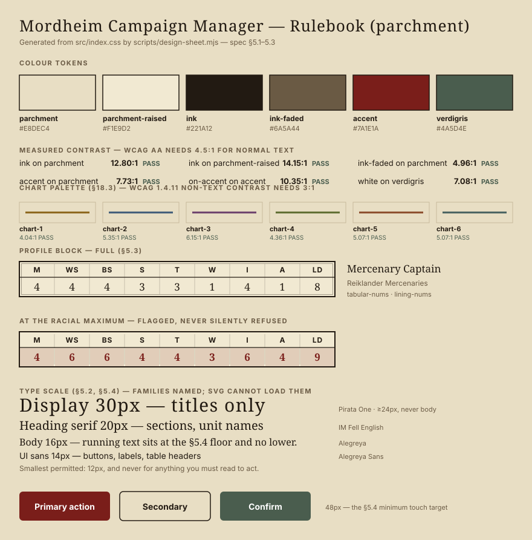
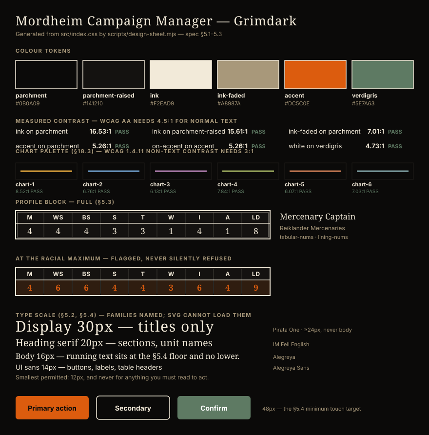

# Mordheim Campaign Manager — Project Specification

A mobile-first Progressive Web App for managing Mordheim warbands and campaigns, including Border Town Burning (BTB) supplement content. Online, account-based, backed by Supabase. Installed via "Add to Home Screen" on Android.

**Owner:** Evin — deployed as a Cloudflare **Worker** serving static assets at `mordheimmanager.net`, built from `main` (`wrangler.toml`). Not a Pages project: the two are grouped together in the dashboard but configured differently, and only the Worker needs a file in the repo. The former Netlify deployment at `mordheim.builderbasement.com` still builds from the same branch while the move settles; `public/_headers` is read by both hosts, while SPA routing is `not_found_handling` on Workers and `netlify.toml` on Netlify.

---

## 0. Status & conflict register

This document started as a design brief written before any code existed. It is now maintained as a description of **the app as built**, with the parts that are still only a plan marked as such. Where the implementation departed from the design, the section says so and gives the reason — the departures are usually the interesting part.

**Conventions:** ✅ built · ◻️ not built · ⚠️ built differently from the design · ❓ open decision.

**Built and deployed:** milestones 1–6 plus the v2 account/campaign work (§8), the Rulebook design language (§5), and the shared-campaign screens. Twenty-two warband lists, 142 equipment entries, the full post-battle wizard, trading post, exploration, rules browser, public gallery, and multi-campaign membership.

### 0.1 Conflict register

A second spec was drafted separately and merged in on 2026-08-03. It was written against the pre-implementation baseline, so it contributed four genuinely new sections (§10 deletion, §11 photos, §12 caching, §13 scale testing) and contradicted the built app in the places below. Each conflict is resolved here so no section has to argue with another.

| # | Conflict | Resolution |
| --- | --- | --- |
| 1 | Default theme: parchment vs Grimdark | ❓ **Owner's call.** Grimdark ships as default today; the PWA manifest colours follow it. Both themes are complete, so this is one constant plus two manifest hex values. §5.5 |
| 2 | Precaching: "disabled, online-only" vs "precache static assets" | **Already satisfied, by a better mechanism.** Runtime caching achieves the goal without a precache manifest — which is what caused the stale-shell failure. §2, §12.4 |
| 3 | `EquipmentItem.quantity` | **Dropped, deliberately.** Duplicates are duplicate rows. §3.1 |
| 4 | `BattleRecord` without `warbandId` | **Built version wins** — without it a player with two warbands got one merged W/L record. §3.1 |
| 5 | `Campaign.joinCode: string` | **Nullable in build** — the leader can revoke rather than only rotate. §3.1 |
| 6 | `HiredSword` without `countsTowardMax` | **Built version wins.** §3.1 |
| 7 | Six bottom tabs incl. "Browse" | ⚠️ **Seven tabs shipped**, gallery reached from Home rather than a tab. The crowding concern is real and recorded. §4 |
| 8 | Fonts self-hosted woff2 | ✅ **Done** — `scripts/fetch-fonts.mjs` pulls the Latin woff2 subsets to `public/fonts/`, `font-display: swap`, no CDN request; SW caches them CacheFirst so they survive offline. §5.2, §12.4 |
| 9 | Dark theme "optional later, not v1" | ⚠️ **Shipped first, as the default.** §5.5 |
| 10 | "Requires login throughout, no logged-out mode" | ⚠️ **The gallery is anon-readable** (migration 0004). This has consequences for photos — see conflict 11. §8.1, §4.7 |
| 11 | Photos on public warbands are "visible to all authenticated users" | **Wrong given conflict 10** — they would be visible to the *entire internet*. Raises the moderation bar before §11 ships. §11.5 |
| 12 | Six open defects listed | **All six are fixed.** Kept as a regression checklist, not a bug list. §14 |
| 13 | Globally unique campaign names | ◻️ **Not implemented.** The incoming text flags the landgrab problem itself; per-creator uniqueness is recommended instead. §10.6 |
| 14 | Seed 100 real users via service-role script | **Complementary, not conflicting.** Demo mode (§13.1) gives UI volume with zero writes; a seed script (§13.2) is still needed for query and RLS performance, and must not run against the live project. |
| 15 | `staleTime` 5 min / 1 min | ⚠️ **30s globally today.** Tiered values adopted as the target. §12.1 |
| 16 | Non-goal "never blocks" vs enforced limits | **Two deliberate exceptions**, both silent-failure cases with unambiguous rules. §1, §9 |
| 17 | Section numbers 9–13 used by both drafts | **Renumbered.** New material became §10–§13; the built-app sections kept their meaning. |
| 18 | Soft delete vs `ON DELETE CASCADE` | **Internal contradiction in the incoming draft** — you cannot soft-delete a parent and cascade-delete its children. Resolved in §10.5. |
| 19 | Leader cannot leave while members remain | ✅ **Enforced in the database** (migration 0010), by a `before delete` trigger rather than a client check, since `removeCampaignMember` covers leave and remove alike. Deleting is likewise blocked while others remain (0011). Both exits exist: hand over, or promote a co-leader and step down (0012). §10.2, §10.3, §10.3.1 |

---

## 1. Goals & Non-Goals

**Goals**

- ✅ Track one or more warbands through a full campaign: roster, experience, advances, injuries, equipment, gold, wyrdstone.
- ✅ Guide the user through the complete **post-battle sequence** as a step-by-step wizard (this is the killer feature — it's the most error-prone part of Mordheim bookkeeping).
- ✅ Keep a campaign log: battles played, scenarios, opponents, results, and BTB campaign objective progress.
- ✅ Require an account and a connection; Supabase is the single source of truth, no offline writes.
- ✅ Export/import all data as a JSON file (manual backup).

**Goals (added in v2)**

- ✅ User accounts and profiles: each player has their own login and manages their own warband(s).
- ✅ Shared campaign view: all members see the battle log, warband ratings, and standings. **BTB campaign objectives remain private to their owner** (secret by the rules) — enforced by a separate table with owner-only RLS, not by client-side hiding.
- ✅ Sync across devices automatically, since Supabase is the only source of truth.

**Goals (added in practice)**

- ✅ **A player belongs to many campaigns.** The original design assumed one; two players turned out to run a league and a side campaign at once. §8.5
- ✅ **Warbands and battles exist outside a campaign.** The app used to invent a campaign called "My Campaign" on the first battle commit, so every player ended up with a campaign they never started.
- ✅ **A public gallery**, readable without an account, so a list can be shown to someone who hasn't signed up.
- ◻️ **Painted miniature photos.** §11.

**Non-Goals**

- No automated rules enforcement beyond warnings — with **two deliberate exceptions**, because in both cases the mistake is silent and the rulebook is unambiguous: the weapon-carrying limits (§9.2) and the equipment-list restrictions (§9.3). Both refuse the *assign-to-model* step; neither blocks buying into the treasury, and neither touches anything a house rule is likely to vary.
- No point-and-click battle resolution; this is bookkeeping, not a game client.
- **The app never rolls dice *for* you — but it will roll *with* you.** ⚠️ The original brief said the app must never roll at all. What shipped is narrower and better: every table offers a **Roll** button *and* a picker for entering the result of a physical die, side by side, both feeding the same handler. Injuries, advances, rare-item availability and Exploration all work this way. The rule that actually holds is that **no outcome is ever applied without the player choosing it** — the app never rolls silently, never rolls on your behalf mid-flow, and never denies you the physical die. Anywhere a new table is added, it inherits this pattern; see §15.

---

## 2. Tech Stack

- ✅ **Vite + React + TypeScript.** Plain React; the Preact alias was never needed.
- ✅ **Tailwind CSS.** Two complete themes (§5.5). ❓ Grimdark is the default; see conflict 1.
- ✅ **State:** TanStack Query for all server data. Zustand for transient UI state (`src/store/useAppStore.ts` for the in-progress post-battle wizard, `useConnectionStatus.ts` for the connection banner). **No persistence middleware.**
- ✅ **Backend:** Supabase — auth, Postgres, row-level security, and `SECURITY DEFINER` RPCs for campaign creation and join-by-code.
- ✅ **Storage:** Supabase Postgres is the sole source of truth. `WARBAND_SCHEMA_VERSION` on every warband blob.
- ⚠️ **Installability & asset caching.** `vite-plugin-pwa` for the manifest, plus **runtime caching only — no precache manifest** (`globPatterns: []`). This is not the same as "no caching", and it is what resolves conflict 2:

  | Request | Strategy | Why |
  | --- | --- | --- |
  | HTML shell (navigations) | `NetworkFirst`, 3s timeout, single fixed cache key | A new deploy is picked up as soon as there's a connection. One key because Netlify rewrites every path to the same `index.html`, so per-URL storage would cache identical copies *and* leave a deep link like `/rules` uncached until visited online. |
  | `/assets/*.js`, `*.css` | `CacheFirst`, 60 entries / 30 days | Content-hashed, so a given URL's bytes can never change. A new deploy requests new filenames, which simply miss. |
  | Fonts and images | `StaleWhileRevalidate`, 60 entries / 30 days | |
  | Supabase | **Never cached** | Warbands, campaigns and battles must never come from a stale copy. |

  A precache *manifest* is what made two correct deploys look broken: workbox served the previous `index.html` out of `workbox-precache-v2` indefinitely, so the app kept booting an old bundle until site data was cleared. Runtime caching gives the same repeat-visit saving without a manifest that can pin a stale shell. **Do not reintroduce `globPatterns` for HTML.**
- ✅ **Deploy:** Netlify, standard Vite build, no Netlify functions.
- ✅ **UI language:** English. All strings in `src/strings.ts`.

**Environment:** `VITE_SUPABASE_URL` and `VITE_SUPABASE_ANON_KEY`, in `.env.local` locally and in Netlify's build environment. No service-role key is ever present client-side or in the repo — see §13.2 for the one script that needs one.

---

## 3. Data Model

All game-content tables live in **static JSON/TS data files**, separate from user data, so content can be added or corrected without touching app logic.

### 3.1 Core entities

As implemented in `src/types.ts`. Differences from the original sketch are called out inline.

```ts
type StatLine = {
  M: number; WS: number; BS: number; S: number;
  T: number; W: number; I: number; A: number; Ld: number;
};

type ModelStatus = 'active' | 'missNextGame' | 'dead' | 'captured' | 'left';

type EquipmentItem = {
  id: string;
  name: string;
  category: 'melee' | 'missile' | 'armour' | 'misc';
  cost?: number;
  notes?: string;
  // NOTE: no `quantity` (conflict 3). A stack of three swords whose middle one
  // is Gromril is not one row with a count, and the weapon limits in §9.2 count
  // carried weapons, which a quantity field makes ambiguous. Duplicates are
  // duplicate entries.
};

type Hero = {
  id: string;
  name: string;
  unitType: string;          // e.g. "Maneater Captain", "Youngblood"
  isLeader: boolean;
  isLargeCreature: boolean;  // counts 20 toward warband rating
  stats: StatLine;
  statMaximums: StatLine;    // racial maximums, from the warband definition
  xp: number;
  startingXp: number;
  advances: Advance[];
  skillLists: string[];
  skills: string[];
  injuries: Injury[];
  equipment: EquipmentItem[];
  photo?: ModelPhoto;        // planned, §11
  spellLists: string[];      // lists this model may draw on
  spells: string[];          // entries known — mirrors `skills`
  status: ModelStatus;
  notes: string;
};

type HenchmenGroup = {
  id: string;
  groupName: string;
  unitType: string;
  count: number;
  isLargeCreature: boolean;
  isAnimal: boolean;         // animals don't gain XP
  stats: StatLine;
  xp: number;                // per member, not per group — see §3.2
  advances: Advance[];
  equipment: EquipmentItem[];// shared loadout, priced per model on purchase
  photo?: ModelPhoto;        // one per group, not per model — planned, §11
  notes: string;
};

type HiredSword = {
  id: string;
  name: string;
  type: string;
  hireFee: number;
  upkeep: number;
  isLeader: false;
  isLargeCreature: boolean;
  countsTowardMax: boolean;  // false by the rules; a field so house rules can differ
  stats: StatLine;
  statMaximums: StatLine;
  xp: number;
  startingXp: number;
  advances: Advance[];
  skillLists: string[];
  skills: string[];
  injuries: Injury[];
  equipment: EquipmentItem[];
  photo?: ModelPhoto;        // planned, §11
  spellLists: string[];      // lists this model may draw on
  spells: string[];          // entries known — mirrors `skills`
  status: ModelStatus;
  notes: string;
};

type Warband = {
  id: string;
  schemaVersion: number;
  name: string;
  warbandType: string;
  gold: number;
  wyrdstoneShards: number;
  treasury: EquipmentItem[];
  heroes: Hero[];
  henchmenGroups: HenchmenGroup[];
  hiredSwords: HiredSword[];
  photo?: ModelPhoto;        // group shot — planned, §11
  notes: string;
  // The BTB objective is deliberately NOT stored here. It lives in its own
  // `objectives` table with owner-only RLS (§8.3) — inside this jsonb blob it
  // would be readable by every campaign member who can read the warband.
};

// Planned, §11. A storage path, never a URL: signed URLs expire, so storing one
// would bake an expiry into the warband blob.
type ModelPhoto = {
  storagePath: string;
  width: number;             // of the stored, already-downscaled image
  height: number;
  uploadedAt: string;        // ISO 8601
};

type Injury  = { id; name; effect; dateAcquired: string; missNextGame?: boolean };
type Advance = { id; type: 'stat' | 'skill'; detail: string; battleRef?: string };

type BtbObjective = {
  id: string; warbandId: string; name: string; progress: string; completed: boolean;
};

type BattleRecord = {
  id: string;
  warbandId: string;         // added (conflict 4): which of the owner's warbands
  date: string;              // this belongs to. Without it, a player with two
  scenario: string;          // warbands got one merged W/L record.
  opponents: string[];
  result: 'win' | 'loss' | 'draw';
  underdogBonus?: number;
  wyrdstoneFound: number;
  goldChange: number;
  casualtiesSummary: string;
  notes: string;
};

type Campaign = {
  id: string;
  name: string;
  usesBTB: boolean;
  visibility: 'public' | 'private';
  joinCode: string | null;   // nullable (conflict 5): the leader can revoke
  createdBy: string;
  notes: string;
};

type CampaignRole = 'campaign_leader' | 'player';
type CampaignMember = { userId: string; role: CampaignRole; joinedAt: string; displayName: string };
type WarbandVisibility = 'public' | 'private';

// Planned, §4.5.
type CampaignEvent = {
  id: string; campaignId: string; title: string;
  eventDateTime: string;     // ISO 8601, date + time
  location?: string; notes?: string; createdBy: string;
};
```

**Read models** — shapes that exist only to be rendered, kept deliberately narrower than the full blob so a screen can't leak more than it should, and so list queries never touch the jsonb (§12.2):

```ts
type PublicWarbandRow = { id; ownerId; name; warbandType; playerName; rating };

type CampaignSummary = {
  campaign: Campaign; role: CampaignRole;
  memberCount: number; battleCount: number; myWarbandCount: number;
};

// Driven by *membership*, not by warbands, so a player who has joined but not
// yet entered a warband still appears — most often the leader, who sets the
// campaign up before building a roster and so used to be absent from their own
// standings. That was defect 1 in the incoming draft; see §14.
type StandingsRow = {
  ownerId; playerName; role;
  warbandId: string | null; warbandName: string | null;
  warbandType: string | null; rating: number | null;
  wins: number; losses: number; draws: number;
};
```

### 3.2 Derived values (computed, not part of the stored blob)

- ✅ **Warband rating** (`src/lib/rating.ts`) = (models × 5) + accumulated XP; large creatures count **20**. Dead, captured and departed models are excluded.
  - A henchmen group's `xp` is the Experience of *each* member, so it counts once per model: `(5 or 20 + group.xp) × group.count`. Counting it once per group understated a group of five veterans by four times their XP.
  - ⚠️ Hired Swords are approximated with the same formula. The rulebook gives flat per-type bonuses ("+22, plus 1 per XP" for a Pit Fighter); those aren't linked to individual records yet. Marked in the source rather than silently wrong.
  - `rating` is also a denormalized column on `warbands`, recomputed and rewritten on every save, so standings never parse jsonb. Never treated as authoritative input. This is the column §12.2 depends on.
- ✅ **Racial maximums** live in one file (`racialMaximums.json`, 29 profiles); every unit points at one by `racialProfile` instead of 125 units each restating the same nine numbers. Centralising closed a real gap: **31 units had no maximums at all**, so they silently received a line of zeroes — and a zero maximum reads as "already at the cap", which blocked every advance. All 125 units that *did* carry hand-entered numbers agreed with their profile exactly, so nothing changed behaviour except the gaps closing.
  - **A unit that cannot gain Experience gets no profile**, deliberately: it never advances, so a ceiling is meaningless and inventing one implies it could. The resolver returns null rather than a fabricated line.
  - Three units keep per-unit numbers, their race having no published profile: Carnival of Chaos's Plague Bearers, Nurglings and Plague Cart.
  - A promoted Henchman ("That Lad's Got Talent") takes his unit type's racial ceiling. He used to be handed *his own current stats* as maximums, freezing him at the numbers he was promoted with.
- ✅ **Max warband size / hero slots** from the warband definition (`src/lib/warbandLimits.ts`). Hired Swords excluded via `countsTowardMax`.
- ✅ **Total upkeep** = sum of hired sword upkeep fees.
- ✅ **Advance eligibility** (`advanceEligibility.ts`, `xpThresholds.ts`).

### 3.3 Static game data files

```
/src/data/
  warbands/              22 files, one per warband type
    maneaters.json         amazons-lustria.json      amazons-mordheim.json
    averlanders.json       battle-monks-of-cathay.json  beastmen-raiders.json
    black-orcs.json        carnival-of-chaos.json    cult-of-the-possessed.json
    dwarf-treasure-hunters.json  gunnery-school-of-nuln.json  kislevites.json
    lizardmen.json         marienburgers.json        middenheimers.json
    orc-mob.json           ostlanders.json           reiklanders.json
    sisters-of-sigmar.json skaven.json               undead.json
    witch-hunters.json
  equipment.json         142 entries: common, rare, and the full Miscellaneous list
  skills.json            Combat, Shooting, Academic, Strength, Speed + warband-specific
  injuries.json          hero serious injury table (D66)
  advances.json          advance roll tables (heroes 2D6, henchmen)
  xpThresholds.json      hero and henchman advance thresholds
  wyrdstonePrices.json   selling table by warband size
  hiredSwords.json       Hired Sword profiles, hire fee, upkeep, skill lists
  scenarios.json         scenario list with page references
  exploration.json       the D66 Exploration chart
  specialRules.json      12 rules shared across warbands, referenced by unit
  racialMaximums.json    29 racial ceilings, shared by every advancing unit
  spells.json            10 spell/prayer/ritual lists, 60 entries
  rules.json             the in-app rules browser index
  changelog.json         user-facing release notes, rendered at /account/changelog
  types.ts               the definition format
  warbandRegistry.ts     imports every warband file; A–Z ordering; unit/rule lookups
  btb/
    objectives.json      campaign objectives
    dramatisPersonae.json
```

**Data sourcing rule (unchanged and still enforced):** populate from the rulebook and the Border Town Burning PDF. Do **not** generate stat lines, prices, or table entries from memory. Anything unverified stays an explicit `TODO: verify vs rulebook p.XX` rather than a plausible guess — a wrong Strength value is worse than a visible gap, because it looks finished.

These files never change at runtime, which is why §12.1 gives them `staleTime: Infinity`.

**Warband definition format** (`src/data/types.ts`) covers hero slots (type, max count, cost, starting XP, skill access, stat line, stat maximums, equipment lists), henchmen types (cost, animal flag, large flag, max count), starting gold, min/max warband size, `equipmentLists`, `exclusiveEquipment` (including dice-priced items carried as `priceRange` text), `rareItemRollBonus`, and both `specialRules` (named, structured) and `notes` (prose not yet split out).

⚠️ **Named special rules are a partial migration.** 39 units still carry rules as unsplit prose under `notes`, shown behind a "to do" badge — visible and honestly labelled rather than dropped.

---

## 4. Screens

Mobile-first. Bottom tab bar on phones, left rail on wider screens.

**Tabs:** Home · Warbands · Battle · Trading · Campaigns · Rules · Settings

⚠️ Seven tabs, not the six proposed (conflict 7). The gallery is reached from Home rather than occupying a tab. The crowding concern is real: seven targets on a narrow phone is tight, and moving Rules and Settings behind an overflow or profile menu is the obvious relief if it starts costing mistaps. Recorded, not yet acted on.

Nav highlighting is not plain path-prefix matching. `NavLink` matches on its own prefix, which lit the wrong tab twice: the battle screens live under `/warbands/:id/…` and lit Warbands, and `/campaigns` lit for `/campaign/:id`. `isNavItemActive` lets an item both claim paths (`activeFor`, `alsoActiveFor`) and disclaim them (`notActiveFor`).

### 4.1 Warband list & roster ✅

- `/warbands` — name, type, rating, gold, shard count.
- `/warbands/:id` — heroes, then henchmen groups, then hired swords. Each row: name, type, XP progress to next advance, injury badges, "miss next game" flag.
- `/warbands/new` — pick from 22 lists (A–Z, with source and fan-supplement grade), name it, done.
- Add hero / henchmen / hired sword each have their own route and validate slot limits, warband maximums, and gold.
- ✅ **Henchmen count is a real number input** — `type="number" inputmode="numeric" min="1"`, select-on-focus, so you type "7" rather than tapping + seven times. Steppers supplement typing, never replace it. The same rule holds everywhere a quantity is entered (gold, shards, XP): see §5.4.
- ✅ Roster rows carry the collapsed profile block §5.3 asks for, so a warrior's Toughness is readable while deploying without opening him.
- ◻️ Photo thumbnails at the left of each row: §11.4.

#### 4.1.1 Printable roster sheet ✅

`/warbands/:id/print` renders the warband as a sheet you can put on the table, laid out after the official Games Workshop sheet (1999) — same sections in the same order, and its field names, so anyone who has filled one in by hand knows where to look. Ours is drawn from scratch in the app's own type and rules; it carries no Games Workshop artwork or branding.

| Section | Fields |
| --- | --- |
| Header | Warband name, warband type, player |
| Heroes | Name, type, statline, Experience track, Equipment, "Skills, injuries, etc" |
| Hired Swords | As Heroes. The original has no such section — you wrote them in among the heroes — but the app models them separately, and on the table they are what a hero is: one named model with a statline. |
| Henchmen | Count, group name, type, statline, Group experience, Equipment, Special rules |
| Foot | Stored equipment, Treasury (gold / shards), Warband rating, ruled Notes |

The **Experience track** is the real one: 90 boxes in three rows of 30 for a Hero, 14 for a Henchman, thick-bordered at every advance threshold. Those numbers were already in `xpThresholds.json`, read off the official PDF. The one thing the app adds over a photocopy is that it knows the total, so the boxes arrive ticked.

Dead, captured and departed models are left off — the sheet is what you carry to a game, and `isInWarband` in `lib/rating.ts` is now the single definition of who is still in the warband, shared with the rating so the two cannot disagree. The rating box shows its working (experience, members, total) because that number gets read out to an opponent before a game.

**Output goes through the browser's print path, not a PDF library.** Generating a file would mean either shipping a layout engine and embedding Alegreya and IM Fell — a few hundred kB for one screen — or rasterising with html2canvas, which turns a sheet made almost entirely of small numbers into a blurry image. Printing keeps the text vector, uses the fonts already loaded, offers "Save as PDF" on every desktop browser and both mobile OSes, and also prints. The screen is a real route rather than a hidden frame, so what you see before pressing the button is what comes out.

`.print-sheet` redefines the §5.1 theme variables rather than restyling components: one block in `index.css`, and every `text-ink`/`border-ink`/`bg-parchment` inside it lands as ink on white without any component knowing it is on a sheet. Neither theme is printable as it stands — Grimdark is a solid black page and an empty cartridge, and even Rulebook's parchment is a beige flood fill costing ink for nothing.

Those overrides sit **outside** `@media print`, so the sheet is black on white on screen as well. Inverting it silently at the print dialog broke the screen's one promise, and hid the ink cost until the paper was already coming out. The preview is also held to 750px — A4 less its margins (210mm − 2×10mm = 190mm ≈ 718px at 96dpi) plus the screen padding `@page` replaces — so it breaks its lines exactly where the printout will. `print-color-adjust: exact` is still needed at print time, because browsers drop backgrounds when printing and the ticked Experience boxes *are* backgrounds.

### 4.2 Hero / henchman / hired sword detail ✅

- Full stat line via `ProfileBlock` (§5.3), editable, with racial maximum warnings — a stat at maximum is flagged and the reason named, rather than the input silently refusing.
- XP tracker with ± and direct typing, threshold markers, and an "Advance due!" banner.
- Advance flow: the user rolls physical dice and taps the result.
- Injuries with effects; equipment moved between model and treasury, subject to §9.2 and §9.3.
- Hired swords share the screen, showing hire fee and upkeep, excluded from slot limits.
- ✅ **Spells, prayers or rituals** for casters — its own block after skills, rolled or chosen in place. §15.

### 4.3 Battle flow ✅

⚠️ Wider than the single wizard originally specced. Three screens, because players wanted the roster in front of them *during* the game:

- **Pre-battle** — scenario (with page reference), opponent picked from the campaign's other warbands rather than typed free-hand.
- **During-battle** — mark models out of action as they go down, so nobody reconstructs the casualty list from memory afterwards.
- **Post-battle wizard** — the original eight steps, staged and committed only at the end:

1. **Battle info** — scenario, opponents, result, date.
2. **Injuries** — per hero out of action: roll D66 on the physical table, tap the result. Henchmen: the D6 died-or-fine choice, rolled by the user.
3. **Experience** — per-model XP with quick buttons for the standard awards; underdog bonus field.
4. **Advances** — everyone who crossed a threshold, resolved as in §4.2.
5. **Dead models cleanup** — equipment to treasury or lost, models removed, emptied groups deletable.
6. **Income** — wyrdstone found, then the selling price for the current warband size. Plus **Exploration**: the D66 chart, with gold and shards banked automatically (§16 for what isn't).
7. **Upkeep & recruiting** — pay hired swords, warn on insufficient gold, jump to Trading.
8. **Confirm** — full diff summary. The commit writes the BattleRecord and updated warband, and stages the pre-battle warband in `previous_data` for a **single-level undo**.

The wizard's in-progress state is transient. If the app closes mid-wizard that progress is lost — the user is warned rather than told a lie about autosave.

### 4.4 Trading post ✅

- **Common** (fixed prices) and **Rare** (rarity value and price range; the user rolls 2D6 + modifiers physically and taps found/not found). `rareItemRollBonus` is shown where it applies.
- Purchases go to the treasury; assignment to models happens on the roster and is where the eligibility rules bite (§9.3). Buying into the treasury is never restricted — the rules restrict *use*, not ownership.
- Henchmen group gear is priced **per model** (`price × group.count`) with its own confirmation. It used to be charged once regardless of group size.
- Selling at half price rounded down, with an override field.

### 4.5 Campaign log, members & events

- ✅ `/campaigns` — every campaign you lead or have joined, with role, member count, battle count, and how many of your warbands are entered. Join code shown to leaders only. Joining by code and starting a new campaign live here, and **only** here — they used to render on the detail screen above whichever tab was open, pushing the standings down behind a form about other campaigns.
- ✅ `/campaign/:id` — three tabs: Log, Standings, Players.
- ✅ **Members panel** lists **every** member including the leader, with display name, warband name/type and rating, and a "leader" badge. A member with no warband yet still appears, with "No warband entered" in the warband columns. The leader is a `campaign_members` row like anyone else, so filtering by `role = 'player'` would drop them — which is exactly the bug that was fixed here (§14, defect 1).
- ✅ **BTB objective panel** — owner-only, enforced by RLS on a separate table (§8.3), never surfaced to other members regardless of the warband's visibility.
- ◻️ Warband rating over time as a line chart (nice-to-have).
- ✅ **Campaign events** — game nights with a date-time picker, optional location and notes, and a banner for the next upcoming one. Three screens rather than the one panel specced here, because scheduling turned out to answer two different questions:
  - `/campaign/events` — the list, and where a leader adds or edits one. It started as a section under the Players tab, which was the wrong home: the campaign screen's tabs are all *records* of what happened, while this is the one part of a campaign that is about the future and the thing people check before leaving the house.
  - `/campaign/calendar` — a month grid. A calendar answers what the list cannot: "are we free that weekend". Cells carry a marker and a count, not titles — a 50px square on a phone cannot hold "Game night — Session 5", and a truncated title is worse than a mark that says "something is here, tap to read it". No date library; one month grid is about forty lines of arithmetic and a dependency for it would be larger than the feature.
  - `/campaign/events/:id` — one event in full, editable in place.
  - Day keys are built from the **local** date parts, never `toISOString().slice(0,10)`, which converts to UTC first and files a 9pm game night under the following day for anyone east of Greenwich.

### 4.6 Account

- ✅ Export all data as a JSON download; import with validation and an overwrite warning.
- ✅ Theme switch (§5.5), account controls, sign in / sign out, changelog at `/account/changelog`.
- ✅ Renamed twice: Settings → Profile → **Account**, which is what the screen actually holds. Every old path still resolves (`/settings`, `/profile`, and both `…/changelog` variants redirect), so bookmarks and links shared in the group chat keep working.
- ✅ Admins get a link to `/admin` from here, shown only when the database says so. Before that the screen was reachable only by typing the URL.
- ◻️ Data-file version display, "report a data error" link, strict-validation toggle. Every data file already carries `schemaVersion` and `source`, so this is presentation work rather than plumbing.
- ⚠️ **Danger zone** — built on each resource's own screen (the warband roster, the campaign screen) rather than gathered here. Deleting a thing belongs where the thing lives: §10.1 requires the user to be looking at what they are destroying, which a central list of everything deletable works against.

### 4.7 Public gallery ✅

`/gallery` — every warband its owner has marked public. `/rosters/:id` shows one read-only.

⚠️ **Readable without an account** (migration 0004 opens the relevant policies to `anon`), which the incoming draft assumed was authenticated-only. This is the one part of the app that works signed out, and it exists so a list can be shown to someone who hasn't registered.

- **Shows:** warband name, type, owner's display name, rating. Tapping opens the read-only roster.
- **Never shows:** the owner's BTB objective (separate table, owner-only RLS), and no field is surfaced by reusing the owner's full roster component unchanged — `PublicWarbandRow` (§3.1) is a deliberately narrow shape.
- **Confirmed:** a `private` warband never appears here even when it belongs to a campaign the viewer is in. Campaign membership grants read *inside* the campaign; the gallery query filters on `visibility = 'public'` as a narrowing, and RLS is the boundary.
- ✅ Filter by warband type, sorted by rating.
- ✅ **Pagination.** `useInfiniteQuery` with a Load more control, replacing the single `.limit(200)`. Also applied to the admin issue inbox and player list. Deliberately *not* applied to the campaign battle log: `useStandingsQuery` derives every player's W/L/D from that same array, so paging it would silently truncate the standings rather than merely showing fewer rows.
- ◻️ Photo group shots as card images (§11.4). A gallery of painted warbands is a far better screen than a list of names, which is an argument for building §11 before investing further here.

### 4.8 Rules browser ✅

`/rules` and `/rules/:ruleId` — a searchable index of weapon rules, skills, and special rules, built from the same data the roster screens resolve against, so a rule shown on a model and a rule read in the browser can't disagree.

⚠️ **Redesigned for density and inline drill-in.** Search is the hero (you usually know the word at a table); below it, the dice roller (§20.1) is embedded in a collapsible row rather than a page of its own, reusing the same `DiceRoller` component the battle screen embeds. The browse is a **chapter accordion** — each of the rulebook's ~20 chapters is a row carrying a lucide icon and its real entry count, expanding in place to its entries, which link on to `/rules/:id`. A **coarse filter** above folds the data's eight fine categories into five groups (Core / Magic / Post-Battle / Trading / Warbands & Scenarios), Magic pulled out of Core because people look for it by name. Search stays a flat, highlighted result list, since collapsing matches into chapters would hide the thing searched for. The shared `RuleEntryList` (used by the embedded Warbands/Trading/Campaign rules panels) is untouched — this restyle is the standalone screen only.

This is the first screen to use an **icon library** (`lucide-react`), a deliberate exception to the app's otherwise hand-drawn icons, chosen for the per-chapter icon set; icons are named imports and tree-shake. Note the shadowing trap it introduced and the fix: lucide exports a `Map` icon, which shadows the global `Map` constructor — imported `as MapIcon` so `new Map()` in the same file still means the built-in.

### 4.9 Issue reports & the admin back-end ✅

Not in either original draft. It exists because feedback was arriving as prose in a group chat, which had to be interviewed back into a reproducible report.

**Reporting** — a button at the foot of every screen opens a textbox in place and files to `issue_reports`. Filing rather than opening a mail client is the whole point: the row carries the path, the build, the user agent and a small context blob (which warband type, which unit), so "the Necromancer has no spells" arrives *with* `{warbandType: undead, unitType: Necromancer}` attached. It works signed out — the rules are public, so a stranger finding a wrong weapon price is exactly who you want to hear from — and insert is anonymous-friendly while **reading** is admin-only, so nobody can enumerate other people's reports.

**`/admin`** (migration 0006, extended by 0007) carries three things:

- The **inbox** — filter by open/triaged/closed, expand for the captured context, mark triaged or closed.
- **Aggregate statistics** from `admin_stats()`: players, warbands, public warbands, campaigns, battles, open issues, a 30-day signup series, and the warband-type distribution — the one number actually worth having, since it says which lists people play.
- A **player list** (`admin_user_overview()`) and a per-player detail screen: counts, last activity, their warbands and campaigns.

Deliberately excluded from every admin function: **email addresses, roster `data` jsonb, and BTB objectives**. Owner-only objectives are the reason that table is separate at all, and an admin screen that reads them would undo it. Aggregates and counts, not row access.

The gate is a row in an `admins` table checked by a `SECURITY DEFINER` function, so an unlinked route is not what protects it — a non-admin who types the URL gets a rendered screen with nothing in it.

---

## 5. Design language — "Rulebook"

The visual direction is the 1999 Mordheim rulebook: aged parchment, heavy black woodcut ink, blackletter display type, blood red. Faithfulness never beats legibility — this is a tool used one-handed at a cluttered game table, on phones and tablets. Every rule below exists to keep both true at once.

### 5.1 Colour tokens

| Token | Hex | Use |
| --- | --- | --- |
| `parchment` | `#E8DEC4` | App background — flat base colour |
| `parchment-raised` | `#F1E9D2` | Cards, sheets, inputs |
| `ink` | `#221A12` | Body text, icons, borders — a warm near-black, not pure `#000` |
| `ink-faded` | `#6A5A44` | Secondary text, placeholders, disabled |
| `blood` | `#7A1E1A` | Primary actions, active tab, links, the accent — used sparingly |
| `verdigris` | `#4A5D4E` | Success/confirm states (aged copper green; never modern bright green) |

**Contrast requirements:** ink on parchment and white on blood must both pass WCAG AA (≥4.5:1) — verified by computing relative luminance, not by eye. `ink-faded` is never used for information the user must read in order to act.

⚠️ **Added token: `on-accent`.** "White on blood" holds in this theme. It does not hold in Grimdark, whose accent is a light ember orange — white on it measures 3.76:1 and fails AA. A shared component cannot hardcode white and stay accessible in both, so the legible foreground for the accent is itself a token: white under Rulebook, near-black under Grimdark.

A subtle parchment texture is allowed on the app background only: low-contrast CSS noise or gradient mottling, never a busy scanned-paper image, never behind body text — cards sit flat on top. If in doubt, flat colour.

### 5.2 Typography

Three roles:

- **Display** — blackletter (Pirata One): the wordmark and screen titles **only**. Minimum 24px, generous letter-spacing. Never body text, buttons, labels, or numbers. Blackletter numerals are unreadable; a number inside a title is set in the heading serif.
- **Heading serif** — IM Fell English (SC for eyebrows): section headings, warband names, unit names. Its rough antique texture carries the rulebook feel at sizes where blackletter fails.
- **Body & UI** — Alegreya for running text at ≥16px, Alegreya Sans for buttons, form labels, tab bar and table headers.

⚠️ **`lining-nums` alongside `tabular-nums`.** Alegreya defaults to oldstyle figures, where zero sits at x-height and reads as a lowercase "o" — which made statlines wrong at a glance. All numeric data uses `font-variant-numeric: tabular-nums lining-nums`.

✅ **Self-hosted** (conflict 8). `scripts/fetch-fonts.mjs` pulls the Latin (and latin-ext) woff2 subsets Google itself serves for exactly the four families and weights used — 19 faces, ~640 kB — to `public/fonts/`, and writes `public/fonts/fonts.css` with `font-display: swap`. The app, landing page and About page all link that local stylesheet; nothing requests the Google CDN. The two dominant above-the-fold faces are preloaded (body + UI in the app; blackletter + body on the landing hero). The whole "Rulebook" look now survives offline and on flaky game-store wifi, which the CDN version did not. See §12.4.

### 5.3 Signature element: the profile block ✅

Unit statlines rendered as the rulebook's profile table — the `M WS BS S T W I A Ld` header row in small caps, values beneath, framed by a heavy 2px ink border with a thin inner rule, on `parchment-raised`. A real `<table>`, so it is a table to a screen reader too. Editable in place via `onStatChange`, with an optional maximums row.

Implemented as `src/components/ProfileBlock.tsx`. ✅ Full form on the detail screens; collapsed form in all three roster listings — your own roster, the read-only shared roster, and the during-battle quick reference. At 375px the collapsed table is 198px wide and shrinks cell padding rather than font size, so its numbers stay at §5.4's 14px floor.

The collapsed form is that narrow-screen compromise **and nothing more**: past `sm` it takes back the printed cell padding and fills its container — 827px in a roster row at 1440px, against 198px before. A shrink-wrapped 200px table with 4px cells stranded in a 900px card read as a phone screenshot pasted into the desktop layout. Width is left to the context rather than hard-coded, so the block spans a block-level parent (a roster row) and still shrink-wraps as a flex sibling (the design sandbox, where it sits beside a name). Font size stays at the stat floor even when the spacing relaxes, keeping a listing one rung below the record it links to.

Supporting details, used with restraint: woodcut-style SVG divider ornaments between major sections (one or two designs, reused), and a drop cap on campaign-log battle narratives. No ornate borders around every card — the rulebook's pages are actually quite plain; its character sits in the type and the ink.

### 5.4 Readability & responsive rules

- Body text ≥16px; statline numbers ≥14px; nothing below 12px anywhere.
- Big touch targets (48px+); XP ± buttons usable with a phone in one hand.
- Phone (<640px): single column, bottom tab bar. Profile blocks may scroll horizontally, but prefer fitting nine stat columns by dropping cell padding, not font size.
- Tablet (≥768px): master-detail — roster left, unit detail right; standings and log side by side. The tab bar becomes a left rail.
- Respect `prefers-reduced-motion`; keep motion minimal regardless.
- **Numeric fields are always directly typeable.** Counts, quantities, gold, XP and shards use real number inputs (`type="number"` / `inputmode="numeric"`), select-on-focus so typing replaces rather than appends. No `<select>` dropdowns of numbers, no ±-only steppers as the sole input path.
- Every destructive action gets a confirm step — and the destructive ones that can't be re-derived get §10's type-to-confirm panel, not a browser confirm.

⚠️ **Known deviation:** tab buttons, the Buy button and the rules filters are 36–40px, short of the 48px minimum. A deliberate density trade-off on dense list screens, recorded rather than quietly accepted.

### 5.5 Two themes ✅

The design listed a dark variant as "optional later, not v1". It shipped first, as the default, because the dark palette was already built when the parchment work began (conflict 9).

- **Grimdark** — near-black surfaces, bone text, ember orange accent. **Currently the default**, and the source of the PWA manifest's `theme_color`/`background_color` (`#0b0a09`).
- **Rulebook / parchment** — §5.1 as written above.

❓ **Open decision (conflict 1):** the merged draft asks for parchment as the default, with the manifest taking `ink` over `parchment`. Both themes are complete, so this is one constant in `src/lib/theme.ts` and two hex values in `vite.config.ts`. Worth deciding on a phone at a game table rather than on a monitor — the argument for Grimdark is battery and low light; the argument for parchment is that it is the actual design language and the one the app is named after.

Every colour resolves through a CSS variable (`rgb(var(--color-x) / <alpha-value>)`) keyed off `data-theme` on the root, so a theme swap redefines ~30 variables instead of rewriting ~1200 utility classes. The `<alpha-value>` form is what keeps Tailwind's opacity modifiers working for the save bar and connection banner.

A design sandbox at `/design` judges components against both themes before migrating screens. It is how the missing-token bug was caught: `parchment` was defined without `ink`, so `text-ink` didn't exist and the page rendered cream on cream — invisible in the CSS, obvious in a screenshot.

### 5.6 Shared UI kit ✅

The tokens and fonts were always consistent; the *components* were not — the same button was hand-written ~11 ways, the card surface 20-odd, and errors sometimes used a raw `text-red-400` that neither palette owns. `src/components/ui/` settles each into one primitive — `Button` (primary/secondary/danger/ghost, md/dense), `Card`, `SectionHeading`/`Eyebrow`, `Field`/`TextField`/`Textarea`/`Select`, with `buttonClasses`/`fieldClasses` for `<Link>`-as-button cases. The primary button's label resolves through the `on-accent` token so it stays legible on the accent in both themes (near-black on Grimdark ember, white on Rulebook blood). Every product screen was migrated onto the kit — including the admin screens, which had been written in the full parchment/ink idiom and were reconciled to the app's dark tokens (a border-and-fill swap, since the role tokens already resolved correctly). The `/design` sandbox carries a live gallery of the kit in both themes. The landing page (`public/landing.html`) is a separate static file that already mirrors the §5.1 token *values* with its own `data-theme` toggle, so it shares the design without importing the bundle.

---

## 6. Build order (as executed)

1. ✅ **Scaffold** — Vite + React + TS + Tailwind + vite-plugin-pwa, Netlify-ready. Data model, Supabase client, JSON export/import.
2. ✅ **Data files** — definition format, `maneaters.json` first, then 21 more.
3. ✅ **Roster** — creation flow, roster view, model detail with XP, advances, injuries, equipment.
4. ✅ **Post-battle wizard** end-to-end with staged commit and undo snapshot.
5. ✅ **M4.5 — Supabase foundation** — auth screens, profiles, schema + RLS.
6. ✅ **M4.6 — Data layer cutover** — direct Supabase reads/writes, `updated_at` concurrency check, connection-lost banner.
7. ✅ **M5 — Shared campaign** — join codes, standings, shared log, read-only warband views, private objectives.
8. ✅ **Trading post, rules browser, exploration, public gallery.**
9. ✅ **PWA polish and Netlify deploy.**
10. ✅ **Rulebook design language** (§5).
11. ✅ **Multi-campaign membership** and the campaigns overview.

12. ⚠️ **M6 — Deletion, removal & naming** (§10). Type-to-confirm, soft delete, campaign deletion and leader-orphaning all landed. Outstanding: the campaign-name decision (§10.6) and the 30-day purge job.
13. ✅ **M8 — Campaign events** (§4.5), as three screens — list, month calendar, detail. The schema had been waiting since 0002.
14. ✅ **M10 — Magic, prayers & rituals** (§15). Structure, data and unit-entry block all landed together, since the owner supplied the transcribed lists.
15. ✅ **Printable roster sheet** (§4.1.1), after the official 1999 sheet, through the browser's print path rather than a PDF library.

**Remaining, in recommended order.** Scale testing comes before photos because it tells you which screens can afford images; photos come before further gallery work because a gallery of painted warbands is a different product from a list of names.

16. ◻️ **M7 — Scale testing** (§13.2–§13.4) and the caching fixes it exposes (§12).
17. ◻️ **M9 — Photos** (§11), then gallery card design (§4.7). Gallery pagination is done.
18. ◻️ **The two-account test** (§14.4). The longest-standing open item: single-account paths are verified end to end, but the owner / campaign-mate / unrelated matrix — and with it the claim the separate objectives table exists to make — has never been exercised. Now also wants a non-admin second account confirming `/admin` yields nothing.

Tested continuously against one real dataset (the owner's Maneaters warband mid-campaign) and once against two live players in a session that produced roughly fifty items of feedback, all triaged and worked through.

---

## 7. Historical: the starting prompt

Kept for the record. This produced milestone 1. Note its instruction "not offline precaching" — §2 now distinguishes data from assets, which that line did not.

> Read `mordheim-manager-spec.md` in this folder. Build milestone 1: scaffold a Vite + React + TypeScript + Tailwind PWA per section 2, implement the data model from section 3.1 in `/src/types.ts`, and set up the Supabase client (env vars per section 8, schema + RLS per sections 8.2–8.3) as the sole data layer — no local database. Add JSON export/import per section 4.6 as a manual backup feature only. Set up vite-plugin-pwa for installability (manifest + icons) only, not offline precaching. Make sure `netlify.toml` + build work with the Supabase env vars. Do not invent any Mordheim game data — create the data file structure from section 3.3 with TODO placeholders only. When done, give me the dev-server command and a checklist of what to verify.

---

## 8. Accounts, Profiles & Shared Campaigns (Supabase)

### 8.1 Auth & profiles ✅

- Supabase Auth with email + password. Register, login, logout, forgot-password and reset-password are built; the reset link returns to `/reset-password`, which requires the redirect URL to be allow-listed in the Supabase dashboard.
- `profiles` (1:1 with `auth.users`): `id`, `display_name`, `avatar_seed`, `created_at`.
- ⚠️ The app is **not** login-only (conflict 10). `/gallery` and `/rosters/:id` are readable signed out. Everything else requires a session. This is a deliberate product decision and it changes the threat model for anything shown on a public warband — see §11.5.

### 8.2 Database schema (Postgres)

```
profiles         id (uuid, = auth.users.id), display_name, avatar_seed

campaigns        id, name, uses_btb, visibility, join_code, created_by, created_at
                 + deleted_at (nullable)                                    -- planned, §10.5

campaign_members campaign_id, user_id, role ('campaign_leader' | 'player'), joined_at

warbands         id, owner_id, campaign_id (nullable), name, warband_type, visibility,
                 data (jsonb — the Warband object from §3.1), rating (denormalized),
                 previous_data (jsonb — the undo snapshot), previous_data_at,
                 updated_at, created_at
                 + deleted_at (nullable)                                    -- planned, §10.5

battles          id, campaign_id (nullable — standalone battles), reported_by,
                 data (jsonb — BattleRecord), created_at

objectives       id, warband_id, owner_id, data (jsonb — BtbObjective), updated_at

campaign_events  id, campaign_id, title, event_datetime, location, notes,
                 created_by, created_at            -- migrated, no UI yet

photo_index      storage_path, warband_id, owner_id                        -- planned, §11.2
```

Rich game state stays as `jsonb` blobs matching the TypeScript types — heroes and equipment are not normalized into relational tables. The app is the only consumer; jsonb keeps sync simple and migrations rare. Only `rating` is denormalized.

**Migrations** (`supabase/migrations/`):

| File | What it does |
| --- | --- |
| `0001_init.sql` | All tables, RLS enabled, base policies |
| `0002_campaign_sharing.sql` | Join codes, the campaign-membership read path, `create_campaign` RPC |
| `0003_unlink_warbands_on_leave.sql` | Trigger: leaving a campaign drops your warbands out of its standings |
| `0004_public_gallery_anon.sql` | Signed-out read access for public warbands |
| `0005_standalone_battles.sql` | `battles.campaign_id` nullable, so a one-off game has somewhere to go |

◻️ **Indexes to add before the scale test** (§13.4): `campaign_members (user_id)`, `campaign_members (campaign_id)`, `warbands (owner_id)`, `(campaign_id)`, `(visibility)`. Membership-subquery RLS policies are the usual thing that falls over at a few hundred rows.

### 8.3 Row-level security ✅

**A. Warbands**

- The creator is `owner_id` and has full read/write on their own warbands, always.
- **Fellow campaign members can always read a warband linked to their shared campaign**, regardless of its `visibility` flag — visibility never hides a warband from its own campaign.
- `visibility` governs read access only from *outside* that campaign (or for an unlinked warband): `public` → any user, and since 0004 any anonymous visitor, may read; `private` → owner and campaign co-members only.
- Policies:
  - SELECT: `owner_id = auth.uid() OR visibility = 'public' OR (campaign_id IS NOT NULL AND EXISTS (campaign_members row for auth.uid() with the same campaign_id))`
  - INSERT: `owner_id = auth.uid()`
  - UPDATE / DELETE: `owner_id = auth.uid()` only — visibility and membership never grant write access. The UPDATE `WITH CHECK` also rejects a `campaign_id` the owner isn't a member of, so this can't push a warband into someone else's standings.

**B. Campaigns**

- The creator gets a `campaign_members` row with `role = 'campaign_leader'`. That role grants management rights; campaign ownership is not a separate concept. **This row must actually be inserted** — the `create_campaign` RPC does it in the same transaction, and its absence would break both the members list and every membership-testing policy.
- Leader: add and remove members, change settings and visibility, regenerate or revoke the join code, delete the campaign.
- Player: read what visibility and membership allow, insert battles, remove themselves.
- Policies:
  - `campaigns` SELECT: `visibility = 'public' OR EXISTS (membership row for auth.uid())`
  - `campaigns` UPDATE / DELETE: the member row with `role = 'campaign_leader'`
  - `campaign_members` SELECT: members of that campaign
  - `campaign_members` INSERT / DELETE: leader for any row; a player may delete only their own (leave)
  - Joining is **join-code only**, through a `SECURITY DEFINER` RPC that validates the code and inserts the `role = 'player'` row server-side. `campaign_members` is never directly client-writable, and the RPC is also what lets a code find a *private* campaign the caller can't yet SELECT.

**Objectives:** owner-only, read and write, regardless of warband visibility. This is precisely why it is a separate table from the warband jsonb — BTB objectives are secret even when the warband is public, and RLS on a separate table is verifiable, while "the client promises not to show that field" is not.

**Battles:** readable under the parent campaign's rule; insert by campaign members; update/delete by the reporter or the leader. A battle with `campaign_id IS NULL` is visible only to whoever reported it.

**Campaign events:** same read rule as the parent campaign; insert by any member; update/delete by the creator or the leader. Policies written; no UI.

⚠️ **Verification status.** Single-account paths are verified end to end against the live project. The two-account matrix — owner / campaign-mate / unrelated — is still outstanding, and with it the claim the objectives table exists to make. §16, and §14.4 for the matrix itself.

### 8.4 Data access model (online-only) ✅

- No local database, no offline writes. Every read and write goes to Supabase.
- Each warband carries `updated_at`; saves use an optimistic-concurrency check (update only if `updated_at` still matches what was loaded). On mismatch the app raises `ConcurrencyError` and asks the user to reload and redo, rather than silently clobbering. Verified against a simulated server: the old path loses the second purchase, the current one catches it.
- Entering or leaving a campaign deliberately sits *outside* that check — it isn't a change to the warband's game state and shouldn't collide with one.
- ⚠️ Real-time subscriptions are not used, and §12.2 argues they should stay unused: an open websocket per member per campaign is ongoing traffic for a screen that changes a few times a week.
- A connection-lost banner surfaces any failed Supabase call, since there is no offline fallback to hide behind.

### 8.5 Campaign flow ✅

1. A player creates a campaign (name, visibility) → becomes `campaign_leader` and gets a short join code (`MRDH-7F2K`; the code alphabet excludes characters that misread on a phone screen).
2. The leader shares the code — the invite card has WhatsApp and Discord share links. Each player registers, enters the code on `/campaigns`, and is added as `role = 'player'` by the RPC. The leader can regenerate the code to close off further joins.
3. Each player links a warband to the campaign and separately chooses that warband's own visibility.
4. Shared screens: **Standings**, **Campaign log**, and read-only views of other members' warbands.
5. The BTB objective stays private to its owner, enforced server-side.

⚠️ **A player belongs to many campaigns.** The original flow assumed one. `pickActiveCampaign` decides which the single-campaign screens (Home, the post-battle commit) treat as current, stored per device outside React Query; `/campaigns` is the overview, and switching is explicit.

---

## 9. Rules the app enforces

Three places where the app does more than warn. Each exists because the mistake is silent and the rulebook is unambiguous — the general non-goal in §1 still stands everywhere else.

### 9.1 Starting equipment ✅

Every model is created with a free dagger — cost 0, per the rule that every warrior has one. It is excluded from the weapon count in §9.2, since it is not a chosen weapon.

### 9.2 Weapon limits ✅

`src/lib/weaponSlots.ts`. A model may carry at most **two** melee weapons and weapons from at most **two** missile types. Counting distinct missile *names* rather than items is what makes "a brace of pistols counts as one" fall out of the rule instead of needing a special case.

### 9.3 Equipment eligibility ✅

`src/lib/equipmentEligibility.ts`, three rules applied in order:

1. **Warband locks** — exclusive gear is buyable only by the warbands that own it (`warbandIds`).
2. **Heroes only** — Miscellaneous equipment is Heroes-only unless explicitly marked `henchmenAllowed`.
3. **Per-model equipment list** — a model may only use items from its own unit's list, *unless* it has the skill that lifts the restriction: **Weapons Training** for hand-to-hand weapons, **Weapons Expert** for missile weapons.

The **treasury is exempt** from all three. The rules restrict what a model may *use*, not what the warband may own, so buying is always allowed and the check happens at assignment.

⚠️ This is where a regression was introduced and caught: seven older warband files referenced equipment ids that didn't exist (`mace`, `hammer`, `club`, `cleaver`). Harmless until the shop started filtering by equipment list, at which point those warbands couldn't buy a club at all. 27 ids repaired, and a cross-file validation pass over all warband data is now part of adding a list.

---

## 10. Deletion, removal & naming rules ⚠️

**Mostly built.** `ConfirmByTyping` (§10.1) exists and is used by every destructive action; warbands soft-delete (migration 0009); campaign deletion is narrowed to a leader who is alone (0011); battle log entries are removable. What remains is naming (§10.6) and the 30-day purge job.

### 10.1 The type-to-confirm pattern

A single reusable `<ConfirmByTyping>` component, used by every destructive action:

- Rendered **inline on the page** — an expanding panel, or a danger zone at the bottom of the resource's screen — **not** as a pop-up or modal. Pop-ups get dismissed reflexively; an inline field forces the user to be where the thing lives.
- Shows what will be deleted, **what else it affects** (the impact lines below), a text input labelled with what must be typed, and a delete button **disabled until the typed value matches**.
- Matching is case-insensitive and trims surrounding whitespace — the point is deliberate intent, not a spelling test. Never accept a partial match.
- The confirm button carries the `blood` accent (§5.1). This is the only place in the app where that colour means danger rather than primary action, so it must sit alone with no competing primary button nearby.
- On mobile the input must not be obscured by the keyboard — scroll it into view on focus.
- After success, navigate away from the now-dead resource and show a toast naming what was deleted. Never leave the user looking at a blank detail screen.

✅ **Built as specced**, with one addition §10.1 didn't anticipate: an optional acknowledgement checkbox above the field. Typing the name proves you know *which* thing you are destroying; it does not prove you have read what else goes with it. Where there is a second party — a campaign losing a standings row — that gets its own deliberate tick, and the button stays disabled until both are satisfied. It appears **only** when there is genuinely a second party: a tick-box on a standalone warband would be ceremony, and ceremony is how people learn to tick without reading.

### 10.2 Deleting a campaign ✅

- Leader only. Type-to-confirm value: **the campaign name**.
- Impact text states, with live counts: how many players, how many battles logged, how many events scheduled.
- Cascade: `campaign_members`, `battles` and `campaign_events` go with the campaign. **Warbands are not deleted** — they belong to their owners; their `campaign_id` becomes `NULL` and they return to standalone. Say this explicitly, so the leader isn't afraid to proceed.
- ✅ **Only while the leader is alone in it** (migration 0011). Since 0001 a leader could delete at any moment, taking every other player's log, standings and game nights with them. Their warbands survive via the 0003 trigger, but the shared record does not — and it is not the leader's alone to discard. While others remain, the screen *explains what to do* ("6 other players are still in this campaign. Remove them, or let them leave…") rather than hiding the button: "why can't I delete this" is the question a hidden control leaves unanswered.
- Counting the members needs a `SECURITY DEFINER` helper. `campaign_members` carries its own RLS, so an inline subquery in the policy would be filtered by the caller's own visibility and could recurse through the membership policies.

### 10.3 Removing a player from a campaign

- The leader may remove any player; a player may remove themselves.
- ✅ **A leader may not leave while other members remain** (conflict 19), and both ways out the spec asked for now exist. Migration 0010 does it with a `before delete` trigger on `campaign_members` rather than a client check, because `removeCampaignMember` serves leave and remove alike and the client is not the only way that row can be deleted. Management rights live *on* that row — the campaigns UPDATE/DELETE policies test `role = 'campaign_leader'` — so a leader who left took them along and the campaign became read-only forever.
  - Last one out is deliberately allowed: leaving a campaign nobody else is in just abandons it, and demanding a transfer with nobody to transfer to would be a trap.
  - Leadership transfer was the missing exit, and it cannot be done from the client as two updates — demoting yourself first loses the rights needed for the second, promoting first leaves two leaders if the second fails. `transfer_campaign_leadership` is one `SECURITY DEFINER` statement pair that checks the *caller* first.
  - Deletion is guarded separately (§10.2, migration 0011): leaving is blocked while others remain, and so is deleting.

#### 10.3.1 Co-leaders ✅

The guards above close the *orphaned* campaign — nobody can walk away and leave it unmanageable. They do nothing about the **stranded** one: a single leader who simply stops turning up still holds the only set of rights, and no one else can rename the campaign, regenerate the code, schedule a game night or delete it. There is no petition and no timeout, so the group's only remedy was to start over.

Migration 0012 allows any number of leaders. Nothing in the schema ever required one: `is_campaign_leader` has always been an `exists (… role = 'campaign_leader')`, true for any count, and 0010's trigger already asks "does another leader remain" rather than "am I *the* leader". What was missing was a way to make a second one, and a way back down.

| Function | Effect |
| --- | --- |
| `grant_campaign_leadership` | Promotes a member. **The caller keeps their own role** — this is the whole difference from transfer. Idempotent: promoting an existing leader is not an error, because a request for something already true has already succeeded and reporting failure only invites a confused retry. |
| `revoke_campaign_leadership` | Demotes a leader, themselves included. Any leader may demote any leader — a hierarchy with an unremovable owner would reintroduce exactly the single point of failure this exists to remove. |
| `transfer_campaign_leadership` | Kept. It is grant + revoke, but as one statement it cannot stop halfway, and "you take over, I'm stepping back" is a real single intent for someone leaving the group. |

**The invariant — a campaign with members has at least one leader — is a `before update of role` trigger, not a check inside each function.** Same reasoning 0010 gives for guarding the leave path in the database: these functions are not the only way that column can ever be written, and a future migration or a console session should meet the same wall. It fires on demotion only, so a grant and the promote half of a transfer pass straight through — which is also why transfer's promote-then-demote order still works under it. `campaign_members` deliberately has no UPDATE policy at all, so a role can change *only* through one of these `SECURITY DEFINER` functions.

In the UI, the old single "Make leader" button silently demoted whoever tapped it. It is now two honest actions — **Make co-leader** (you both lead) and **Hand over** (they lead, you don't) — plus **Step down as leader** on your own row, which is distinct from Leave: conflating them was why handing over used to cost you your seat in the campaign as well. The only-leader notice names the way out rather than only the wall, since being the sole leader is now a fixable state.
- Type-to-confirm value: **the player's display name** (leader removing someone) or **the campaign name** (player leaving — their own name is too easy to type absent-mindedly).
- Impact: their warband leaves the campaign (`campaign_id` → `NULL`) but is not deleted; battles they reported stay in the log, attributed to their name. ✅ The unlink half already works — migration 0003 does it with a trigger.
- A removed player can rejoin with the join code unless the leader regenerates it.

### 10.4 Deleting a warband

- Owner only. Type-to-confirm value: **the warband name**.
- **If linked to a campaign**, the impact panel names the campaign and states that the warband will disappear from its standings and members list, and that its battle records stay in the log. Required within the panel, not a separate step.
- Cascade: the `objectives` row and all model photos in Storage (§11.5) go with it. Battles stay — they're campaign history, not warband data.

### 10.5 Soft delete, and what it does to cascades

Implement all three as **soft deletes**: set `deleted_at`, and filter it out of every query *and every RLS policy*. A mistaken deletion becomes recoverable by the operator, and battle history keeps its foreign keys intact. Purge rows older than 30 days with a scheduled job.

✅ **The purge exists** (migration 0014): `purge_deleted_warbands()` on pg_cron nightly at 03:17, with `admin_purge_deleted_warbands()` as the operator's manual trigger from §4.9. Retention is a parameter defaulting to 30 days, so the job can be exercised against a shorter window without re-pushing the function that deletes people's warbands.

⚠️ **It is two steps, because SQL cannot delete a Storage object.** `storage.objects` is metadata; removing a row there does not free the underlying file — only the Storage API does, which needs a session. And the ordering problem is sharper than it looks: `warband_photos` cascades away with the warband, so the instant the row goes, the only record of *which* files belonged to it is gone. The bytes remain as an orphan nobody can even name.

So paths are copied into `storage_purge_queue` **before** the rows are deleted, in the same transaction, and the queue is drained from the admin screen. This is the 0013 upload rule read backwards: there the row is written last so it never points at bytes that don't exist; here the row is deleted last so the bytes never outlive the last reference to them. §11.5 warns that client-side cleanup is unreliable — true of cleanup at *deletion time*, where a closed tab loses the work, and precisely what a durable queue answers: a failed drain changes nothing and is run again.

⚠️ **Resolving conflict 18.** The incoming draft asked for soft delete *and* described children being "removed with the campaign" by cascade. Those are incompatible: `ON DELETE CASCADE` fires on a real `DELETE`, which a soft delete never issues. Pick one per table and be explicit:

- **Soft-deleted parents, filtered children.** `campaigns.deleted_at` and `warbands.deleted_at` are set; `campaign_members`, `battles` and `campaign_events` are left in place and become unreachable because every query joins through a parent that is now filtered out. Simplest, fully reversible, and the recommendation.
- The alternative — soft-delete the parent *and* hard-delete the children — gets the worst of both: unrecoverable, and the parent row survives pointing at nothing.
- Warband photos are the one genuine exception: Storage objects cost quota whether or not a row is soft-deleted, so they are hard-deleted on the 30-day purge, not on the soft delete. Until then the warband is fully restorable.

If soft delete is skipped, be deliberate about it — hard deletes plus `ON DELETE CASCADE` will remove more than the impact text promises.

### 10.6 Campaign name uniqueness ❓

Two players in the same group both starting "Border Town Burning" is genuinely confusing. The question is how wide the uniqueness should be.

- **Global, case-insensitive** — `CREATE UNIQUE INDEX ON campaigns (LOWER(name)) WHERE deleted_at IS NULL;` Solves the confusion, but lets an unrelated group take a common name and block yours forever. That gets worse as the app grows, and "Border Town Burning" is exactly the name everyone reaches for.
- **Per creator** — `UNIQUE (created_by, LOWER(name))`. You can't have two campaigns with the same name; other people can. Solves the confusion actually described — players see one campaign per name in their own list — without the landgrab.

**Recommendation: per creator.** Global uniqueness buys nothing extra here, since players find campaigns by join code rather than by searching names.

Either way: the create/rename form checks availability as the user types (debounced) with an inline "That name is taken", *and* handles the constraint error on submit for the race. And note the interaction with §10.5 — a soft-deleted campaign still occupies its name. Either free the name on delete by appending a suffix to the stored value, or tell the user why a name they can't see is taken.

---

## 11. Model & warband photos ⚠️

One photo per warband (group shot) and per hero, henchmen group and hired sword. Painted miniatures are half the hobby — this is the feature that makes a roster feel like *your* warband.

✅ **Both are built** — the warband group shot (migration 0013) and per-model portraits for heroes, hired swords and henchmen groups (0015).

⚠️ **The record does not live in the warband jsonb**, contrary to §11.1. That plan needed a `photo_index` table anyway, purely so Storage RLS could resolve ownership — and §11.2 then called keeping that index in step with the blob "the fragile part". So `warband_photos` *is* the record, and there is only one copy to keep in step. Two further reasons, both specific to this app:

- `warbands` saves carry the `updated_at` they last read and are queued per warband (§14, defect 3). A photo in the blob makes uploading a picture a roster **save**: it collides with pending characteristic edits and is refused as "changed elsewhere", and it drags the entire roster through the save path to change an image.
- A real row gets a foreign key, so deletion and the 30-day purge cascade. jsonb cannot.

One photo per warband is the table's primary key, not an application check.

### 11.0 CRUD ordering

Storage and Postgres cannot share a transaction, so **the order of operations is the whole design**. One rule holds it together: *the row is only ever written once the bytes it points at exist.* Orphaned objects are cheap, invisible and sweepable; a row pointing at a missing object is a broken image in the user's face.

| | Order | Why |
| --- | --- | --- |
| Create | upload → insert row | An upload that fails changes nothing |
| Replace | upload to a **new** path → update row → delete old objects | Never overwrite in place: every cached signed URL and CDN copy would go on serving the previous picture, so a replace would look as though it had silently failed |
| Delete | delete row → delete objects | The row is what the UI reads, so removing it *is* the deletion as far as anyone can tell |

There is deliberately **no UPDATE policy on `storage.objects`** — replacement writes a new path, so nothing ever needs to overwrite. Failures in the trailing cleanup cost quota and nothing else, and are not worth failing an upload the user has already watched succeed.

### 11.1 Summary

| Piece | Choice |
| --- | --- |
| File storage | **Supabase Storage** — a new service, same project and keys |
| Buckets | The project's shared **private** `images` bucket; access via signed URLs only |
| Path convention | `warbands/{owner_id}/{warband_id}/{full\|thumb}-{timestamp}.webp` — prefixed, since the bucket is shared |
| Database | No blobs in Postgres. Only the `ModelPhoto` record (§3.1) inside the existing jsonb |
| Client work | Resize and re-encode **before** upload, HEIC handling, camera capture, cropping |
| Cost | Free tier is 1 GB storage / 2 GB egress per month — §11.5 |

### 11.2 Bucket & security

- **Private bucket** (`public = false`). A public bucket serves every object at a predictable URL to anyone on the internet with **no policy consulted at all**, bypassing §8.3 entirely — and warbands can be private. Because `images` is shared with whatever else the project stores, 0013 does not merely assume this: it creates the bucket private if absent and **raises rather than proceeding** if it exists and is public, so the feature cannot quietly publish photos.
- Storage RLS mirrors §8.3, keyed on the path segments:
  - INSERT / DELETE: `(storage.foldername(name))[1] = 'warbands' and [2] = auth.uid()::text` — a user writes only under their own prefix, and these policies claim only warband objects rather than everything in a shared bucket whose first segment happens to be a uuid.
  - **No UPDATE policy at all.** Replacement writes a new path (see §11.0), so nothing ever needs to overwrite.
  - SELECT: the read cases from §8.3, via `can_read_warband`. Storage policies can't traverse into warband jsonb — which is one of the reasons the record is a table rather than a blob field, so the join has something real to join against.
- Serve via **signed URLs**, cached in TanStack Query for their lifetime so you aren't re-signing per render. See §12.3 for why the expiry length is a bandwidth decision, not just a security one.

### 11.3 Client-side upload pipeline

A modern phone camera produces 4–12 MB images. Uploading those raw is the single thing most likely to make this feature feel broken on mobile data. Before upload:

1. **Accept the file:** `<input type="file" accept="image/*" capture="environment">` — the `capture` hint opens the camera directly on Android while still allowing gallery choice.
2. **Handle HEIC.** ✅ Decided: **reject with instructions**, no decoder shipped. `heic2any` is several hundred kB on an entry chunk already over Vite's warning, for a case iOS mostly avoids by converting to JPEG on upload unless "Keep Originals" is set. The message names the exact setting (Settings → Camera → Formats → Most Compatible) and the Photos → Share → Copy Photo workaround for an existing shot. Silently failing on iPhone uploads is the classic version of this bug, so the one thing it must not do is nothing.
3. **Correct EXIF orientation** before resizing, or portrait photos arrive rotated.
4. **Downscale and re-encode:** longest edge max **1600px**, **WebP** at ~0.8 quality. Also generate a **320px thumbnail** for roster rows and the gallery — loading full images into a list is the second-biggest trap. Store both, thumbnail path derivable by convention.
5. **Square-ish crop UI:** miniature photos vary wildly. A fixed aspect ratio (1:1 for models, 3:2 for the group shot) keeps roster rows visually consistent.
6. **Validate:** reject non-images by actual type, not extension; cap raw input at ~20 MB and processed output at ~500 KB.
7. **Show progress and a clear failure state** — per §8.4 there is no offline queue, so a failed upload must say so rather than appearing to succeed.

### 11.4 UI integration

- **Roster rows:** small thumbnail at the left. ⚠️ **No placeholder when absent**, contrary to this section's original instruction. A silhouette in every row makes each warband without a picture look like one that failed to load — and since most warbands have none, that would be the app's ordinary appearance rather than an exception. The cost is accepted knowingly: rows no longer share a left edge, and a row without a photo simply uses the width. (Never a broken-image icon still holds; that was never the alternative.)
- **Detail screens:** photo above the §5.3 profile block, tap for full size. Owner sees replace/remove; others see the image only.
- **Warband list and gallery:** the group shot becomes the card image.
- **Design fit:** frame photos with the same 2px `ink` border as the profile block, so they read as plates in the rulebook rather than social-media cards. Slight desaturation on thumbnails is optional and should be tested, not assumed.

### 11.5 Cost, quota & moderation

- Free tier: **1 GB storage, 2 GB egress/month**. At ~150 KB per processed photo, 1 GB is roughly 6,500 images — plenty for a private group. **Egress is what bites first**, and the gallery is what spends it.
- ✅ Deleting a warband must delete its Storage objects — orphaned files silently consume quota. Done by the 30-day purge and its drain queue rather than at deletion time, since a soft-deleted warband is still restorable and must keep its photo. See §10.5 for why it is two steps and why the queue exists.
- ⚠️ **Moderation bar is higher than the incoming draft assumed (conflict 11).** It said public-warband photos become "publicly visible content" to *authenticated users*. Since migration 0004, the gallery is readable **without an account** — so a photo on a public warband would be visible to the open internet, and indexable.
- ✅ **Decided before shipping, as this section required: photos are signed-in only.** `warband_photos_select` and the storage read policy are both `to authenticated` with no `anon` counterpart. The gallery still works signed out — names, types, ratings — and pictures appear once you have an account. Deliberately narrower than the surrounding screen, because it drops the moderation and takedown burden a long way for the cost of one sentence in the UI, and because "you can browse warbands without registering" survives it intact.

### 11.6 Build order

1. ✅ Bucket + storage RLS + `warband_photos` (0013).
2. ✅ The processing pipeline as `lib/imageProcessing.ts` — `createImageBitmap` with `imageOrientation: 'from-image'` decodes and un-rotates in one step, and a canvas re-encodes to WebP, so §11.3 needs no dependency at all. Verified in demo mode: a 5.5 MB 3000×2000 PNG became a 13 kB 1600×1067 WebP with a 3 kB 480×320 thumbnail at exactly 3:2; a 1200×1200 source stayed 1200×1200 rather than being upscaled. Both failure paths report rather than fail silently — a text file named `.jpg`, a `.heic`, and a 21 MB input each produce their own message.
3. ✅ Wired into the roster (owner controls) and the warband list (thumbnails), and ✅ into heroes, hired swords and henchmen groups — each with its own portrait, cropped 1:1 against the group shot's 3:2, and carried onto the printed sheet (§4.1.1).
4. ✅ Deletion cleanup, via the 30-day purge and its drain queue (0014, §10.5). ◻️ The quota check — nothing warns as the 1 GB storage or 2 GB monthly egress limits approach, and `admin_stats()` does not report either.
5. ⚠️ Tested on a real **Android** phone (Galaxy S25) — camera capture, upload and per-model portraits all confirmed by the owner. ◻️ **iPhone is still untested**, which is where the interesting failure lives: HEIC is the one input the pipeline deliberately refuses rather than decodes (§11.3), and nothing has yet confirmed iOS actually hands over JPEG in the common case.

⚠️ **Not a crop UI.** §11.3 asks for one; the thumbnail is centre-cropped to 3:2 instead. That is what makes a row of cards line up, and a miniature is almost always in the middle of the frame — but choosing *which* part of a photo to show is a real feature and this is not it.

---

## 12. Caching & bandwidth

The app is online-only (§8.4), so every screen costs data. The Supabase free tier allows **2 GB egress/month** across database and storage combined — and once photos ship, images will dominate. §12.5 is the audit, already run against the current code.

### 12.1 Query caching (TanStack Query) ⚠️

Currently configured globally in `src/main.tsx`: `staleTime: 30_000`, `gcTime: 5 * 60_000`, `refetchOnWindowFocus: true`, `retry: 1`. That already fixed the worst problem — with the library default of `staleTime: 0`, opening a hero, going back, and opening the next one re-ran the warband query each time, a visible stall per tap on a phone.

Target (conflict 15):

| Data | `staleTime` | Reason |
| --- | --- | --- |
| Static game data (§3.3) | `Infinity` | Bundled JSON; it cannot change at runtime |
| Warband / roster | 5 min | Only you edit it |
| Campaign standings and log | 1 min | Someone else may have reported a battle |
| Public gallery | 5 min | Changes rarely, costs the most |

- `gcTime` 30 min, so navigating back to a screen is free.
- `refetchOnWindowFocus`: keep **true** for campaign screens — coming back to the tab should show whether a campaign-mate reported a battle — and set **false** for the gallery and any list that fetches many rows. On a phone every app-switch is a focus event, which makes blanket `true` a silent drain on exactly the heaviest queries.
- Invalidate precisely after mutations: the affected warband's key, not the whole cache.
- ◻️ **Optimistic updates** for small edits (XP +1, gold change): update the cache, write, roll back on error. Avoids a refetch per tap.

### 12.2 Fetch narrowly — the biggest win

- **Never `select('*')` on `warbands` in a list view.** The `data` jsonb is the largest object in the app; a page of 25 warbands fetching blobs is megabytes for a screen showing names and ratings. This is what `rating` is denormalized for (§3.2).
- ✅ `fetchCampaignWarbands` and `fetchPublicWarbands` already select `id, owner_id, name, warband_type, rating` plus the profile join — the two list views that matter most are correct.
- ⚠️ **`fetchWarbands(ownerId)` still does `select('*')`** — the owner's own list at `/warbands`. Harmless at two warbands, wrong in principle, and the first thing to break for a player with a dozen. Narrow it, and fetch the blob only on the roster screen. §16.
- `battles` and `objectives` also use `select('*')`, but those rows are small and fully rendered; leave them.
- Use keyset pagination everywhere (§13.3), page size 20–25.
- Prefer a Postgres view or RPC for joined screens so one round trip returns exactly the columns the UI renders. The members panel is currently three batched queries, which is already far better than the obvious one-per-campaign loop.
- Realtime: keep it unused (§8.4).

### 12.3 Images — expect ~80% of egress once §11 ships

- **Serve the 320px thumbnail in every list.** The failure mode is quietly using the 1600px original in roster rows: one full-size image ≈ 10 thumbnails.
- `loading="lazy"` on all list images, with explicit `width`/`height` from the `ModelPhoto` record to avoid layout shift.
- **Signed-URL caveat:** a fresh signed URL is a new URL, so the browser cache misses and the image downloads again every time. In order of preference: (a) sign with a long expiry (7 days) and cache the URL in TanStack Query with a matching `staleTime`, so the same URL is reused; (b) set a long `cacheControl` at upload so the CDN and browser retain the object; (c) a public bucket path for genuinely public warbands only — but read §11.2 and §11.5 first, and never for private warbands.
- Upload-side compression (§11.3) is the other half: 150 KB WebP against a 6 MB original is 40× in both directions.

### 12.4 Static assets

- ✅ **Fonts self-hosted.** §5.2's four families now ship as Latin woff2 subsets from our own origin (`scripts/fetch-fonts.mjs` → `public/fonts/`, ~640 kB across 19 faces), `font-display: swap`, above-the-fold faces preloaded, and cached CacheFirst by the service worker for offline. No Google CDN request is made — closing the largest unclaimed first-load win and removing a third-party dependency from every page.
- ✅ **Service worker: already correct** (conflict 2). The incoming draft read "no precaching" as "no asset caching" and recommended enabling precache. The app instead uses **runtime caching** — `CacheFirst` on content-hashed `/assets/*.js|css`, `StaleWhileRevalidate` on fonts and images, `NetworkFirst` on the HTML shell, Supabase never cached. That achieves the repeat-visit saving *without* a precache manifest, which is what pinned a stale `index.html` through two deploys. See the table in §2. Do not reintroduce a manifest for HTML.
- Verify Netlify actually serves hashed build assets with immutable cache headers rather than assuming it.
- ◻️ Check bundle size with `vite-bundle-visualizer`. The production bundle is currently **1,068 kB raw / 285 kB gzipped** in one chunk, which already trips Vite's 500 kB warning. Look for full-library imports, a date library where `Intl` would do, and wholesale icon sets — then consider route-level code splitting, since the post-battle wizard and the rules browser are both large and rarely on the critical path.

### 12.5 Audit results

Run against the current code on 2026-08-03. This is the incoming §13.6 checklist, answered rather than left open.

| # | Question | Finding |
| --- | --- | --- |
| 1 | Query cache wired, or `supabase.from` in `useEffect`? | ✅ **Clean.** No `supabase.from` anywhere outside `src/api`; every screen goes through a TanStack Query hook. |
| 2 | `staleTime` / `refetchOnWindowFocus` configured? | ⚠️ Configured globally (30s / true), not tiered. Target in §12.1. |
| 3 | `select('*')` in list contexts? | ⚠️ **One real hit:** `fetchWarbands` (owner's list). `battles` and `objectives` also use it but return small, fully-rendered rows. The two big list views are already narrow. |
| 4 | Fonts from the Google CDN? | ✅ **No longer** — self-hosted Latin woff2 subsets (`scripts/fetch-fonts.mjs` → `public/fonts/`), `font-display: swap`, no third-party request. |
| 5 | Originals or thumbnails? `loading="lazy"`? | N/A — one `` in the whole app (the banner). Revisit the moment §11 ships. |
| 6 | Duplicate requests per screen load? | Not yet measured; needs the seeded dataset and a Network-tab pass (§13.3). |
| 7 | Service worker, and what does it cache? | ✅ Registered, runtime-caching only, no precache manifest. Correct as built — see §12.4. |

### 12.6 Targets

Add to the §13.3 scale test: DevTools → Network, hard-reload each screen, record **transferred bytes** for first load and repeat visit. On a seeded database: first load under ~1 MB, repeat visit under ~150 KB, any list screen under ~300 KB. Watch Supabase's egress graph while running the seeded gallery — that is the number that decides whether the free tier holds.

---

## 13. Scale testing, seed data & dev tooling

The app has been tested with one real warband. Every list is a "fetch everything and map" — fine at 5 rows, not at 500. Two separate tools serve two separate purposes, and conflating them is conflict 14.

### 13.1 Demo mode ✅ — UI volume, zero writes

`src/dev/` — a dev-only mode filling the app with fabricated data so screens can be judged at realistic volume: **50 players, 2 warbands each, 10 campaigns of 5–10 members**, with battle logs and standings.

- **Nothing reaches the database.** Every read is answered from an in-memory generated set; every write stays there. This is the point: seeding a hundred warbands into the live project would put them in the same tables as the real campaign and surface them in other players' standings and the public gallery.
- **Dev builds only.** Gated on `import.meta.env.DEV`, which Vite replaces with `false` in production, so the branch and its imports are dropped at build time rather than merely unreachable. Verified against `dist/`: none of `demo-user-`, `generateDemoDatabase`, `mordheim.demoMode` or the generated campaign names survive the build.
- **Shaped as a normalised database**, not ready-made screen props, so `demoApi.ts` answers each query the way the real API layer does. Anything the API composes from smaller calls (standings = members + campaign warbands) needs no demo implementation, because the calls it composes are themselves intercepted.
- **Seeded**, so the same run produces the same warbands and ratings and screenshots stay comparable.
- Rosters are built through the app's own factory, so standings ratings are computed numbers. A fabricated rating would make the sorting look right while saying nothing about whether the calculation is.
- Toggle with `?demo=1` / `?demo=0`, or from Settings in a dev build.

**What it cannot tell you:** anything about queries, indexes, RLS performance or egress — all of which it replaces. That is what §13.2 is for.

### 13.2 Seed script ◻️ — real rows, for measuring

| Entity | Count | Notes |
| --- | --- | --- |
| Users | 100 | `auth.admin.createUser`, each with a `profiles` row |
| Warbands | 300 | 3 per user; vary type, rating and `visibility` (~60% public) |
| Campaigns | 20 | Vary visibility; unique names (§10.6) |
| Campaign members | 300 | 15 per campaign, so each user sits in ~3 |
| Battles | ~40 per campaign | ≈800 total, over believable dates |
| Campaign events | 5 per campaign | Some past, some upcoming |
| Photos | Skip, or a handful of placeholders | Don't burn the 1 GB quota (§11.5) on seed data |

Rosters must be realistic, not minimal — 6 heroes, 3–4 henchmen groups, 1–2 hired swords, varied XP, injuries and equipment. A realistically-sized jsonb blob is what makes the §12.2 measurements honest.

- A standalone `scripts/seed.ts`, run with the **service-role key** from a local `.env`. Never bundled, never committed. This is the only thing in the project that needs that key.
- Deterministic (fixed seed) so runs are reproducible and bugs repeatable — the same reasoning as §13.1.
- `scripts/seed-teardown.ts` removes everything it created, matching on an email pattern like `seed+{n}@example.test`.
- ⚠️ **Run against a separate Supabase project.** Not "before your real data exists" — that ship has sailed; the live project holds a real campaign and a second player's data. A throwaway project is now the only safe option.
- Log in as a seeded user to *experience* the app at scale, not only to measure queries.

### 13.3 What to measure, screen by screen

Load time on a throttled connection (DevTools "Fast 3G"), and whether the query fetches more than it displays:

| Screen | Risk | Expected fix |
| --- | --- | --- |
| Public gallery (§4.7) | 180+ public warbands; currently one `.limit(200)` with no paging | Paginate; already selects narrow columns |
| Campaign members (§4.5) | 15 rows joining profiles + warbands | Verify it's one round trip, not 15 |
| Campaign log | ~40 battles per campaign | Paginate or infinite-scroll, newest first |
| Warband list | 3 per user | Fine — but fix the `select('*')` (§12.2) |
| Roster / detail | Large jsonb blob | Fine; confirm one warband, not all |
| Standings | 15 warbands with ratings | Confirm it reads the denormalized `rating` column |

**Pagination approach**, in order of preference on a phone:

1. **Infinite scroll with a sentinel** (IntersectionObserver + `useInfiniteQuery`) — no tiny page-number targets.
2. **Explicit "Load more"** — better when the user wants to reach the bottom (the campaign log) and for accessibility; also cheaper to get right.
3. Numbered pagination — avoid on mobile.

Page size 20–25. Use **keyset pagination** (`WHERE created_at < :cursor ORDER BY created_at DESC LIMIT 25`), not `OFFSET`, which degrades and can skip rows as data shifts. Skeleton rows while loading, never a layout-shifting spinner. Any list that can exceed ~50 rows needs a search or filter field, not just paging — scrolling to find one warband among 180 is not a feature.

### 13.4 Also check under load

- Does the campaign-name unique index (§10.6) actually reject a duplicate across 20 campaigns?
- Do RLS policies still perform with 300 `campaign_members` rows? Membership-subquery policies are the usual culprit — add the indexes listed in §8.2 first, then measure.
- Does deleting a seeded campaign with 15 players and 40 battles behave exactly as §10.2 promises?

### 13.5 Design sandbox ✅

`/design` — components rendered against both themes, for judging them before migrating screens. It is the authority for anything interactive: focus rings, editable profile cells, hover and pressed states, and how a block reflows when nine stat columns meet a 360px phone.

The sheets below are the static half of that, generated so the spec can show the design rather than describe it:

```bash
npm run design-sheet
```

`scripts/design-sheet.mjs` reads the theme tokens straight out of `src/index.css` and writes one SVG per theme into `docs/design/`. Nothing in them is hand-drawn or hand-copied — the swatch hexes come from the stylesheet, and **the contrast ratios are computed from those same values** rather than transcribed. A token edited without re-running shows up as a diff; a token change that drops a pair below AA prints `FAIL` and exits non-zero.

#### Rulebook (parchment) — §5.1 verbatim



#### Grimdark — the same roles, different values



Reading them side by side is the point of §5.5: the token *names* are the spec's, but what they mean is the **role**, so `parchment` is "the page" and `ink` is "text on it" even where that resolves to bone on near-black. The profile block, the type scale and the touch targets are identical in both — only the values move.

**Two limits worth knowing:**

- **Fonts don't load.** An SVG embedded via `` can't fetch a webfont, so the type scale shows the *sizes* and names the intended family beside each line rather than pretending to render Pirata One. For the real thing, open `/design`.
- **The sheet has to render what the components render.** The first draft put `parchment-raised` on the verdigris confirm button and produced a 3.95:1 failure that exists nowhere in the app — the components use white, which measures 4.73:1 under Grimdark and 7.08:1 under Rulebook. That pair is now in the checked set. A sheet that invents a plausible substitute is worse than no sheet, because it reports bugs that aren't there.

The generator also caught a real error in the other direction: the Grimdark `on-accent` comment in `src/index.css` claimed 8.9:1 for near-black on ember. It is **5.26:1** — still comfortably past AA, so the decision to use near-black over white (3.76:1) was right, but the recorded number was not. That is the whole argument for computing these rather than writing them down.

### 13.6 Repository conventions

- **Never commit real data exports.** `mordheim-backup-*.json` is gitignored.
- **Never put design sources in `public/`.** Vite copies that directory verbatim into `dist/`, so anything there is served publicly; `public/**/*.ai` and `*.psd` are gitignored for that reason.
- **Verify pushes.** A push once failed silently and GitHub sat a commit behind local for a day. Run `git ls-remote` after pushing, not just a clean exit code.
- **Never seed, test against, or point a script at the live Supabase project.** §13.2.

---

## 14. QA checklist

The incoming draft carried six open defects. **All six are fixed** (conflict 12). They are kept here as a regression checklist, because each was found by a real player and each is the kind of thing that quietly comes back.

### 14.1 Closed defects

| # | Area | Symptom | Status |
| --- | --- | --- | --- |
| 1 | Campaign members | Leader not listed as a member | ✅ Fixed — standings are built from *membership*, not from warbands (§3.1, §4.5) |
| 2 | Campaign members | List lacked name / warband / rating | ✅ Fixed — joined through `profiles` and `warbands` |
| 3 | Henchmen | Group count couldn't be typed | ✅ Fixed — real number input (§4.1) |
| 4 | Warband creation | "Doesn't work well" | ✅ Audited and fixed; acceptance tests below |
| 5 | Trading post | "Purchases don't work well" | ✅ Audited and fixed; group gear now priced per model |
| 6 | Public warbands | View didn't exist | ✅ Built, and readable signed out (§4.7) |

### 14.2 Warband creation — acceptance tests

1. Name, type and starting gold persist and survive a reload (confirm the row in Supabase, not just the UI).
2. The warband appears in the owner's list immediately after creation (cache invalidation, not a stale query).
3. Adding a hero respects slot limits; exceeding one warns without hard-blocking (§1).
4. A henchmen group with a typed count of 7 stores 7 — not 1, not NaN.
5. Recruitment cost is deducted, and gold cannot silently go negative — warn instead.
6. Rating recomputes and the denormalized column updates on every save (§3.2).
7. Linking to a campaign sets `campaign_id`, and the warband appears in that campaign's standings.
8. A second account cannot see it if `private` with no shared campaign; can if `public`; can always if they share a campaign (§8.3).

### 14.3 Trading post — acceptance tests

1. Buying a common item deducts the correct price and adds it to the treasury.
2. Buying with insufficient gold warns and does not complete. *(Pick one behaviour and keep it consistent — warn-and-block, or warn-and-allow-with-override. Do not let it vary by screen.)*
3. ⚠️ **Amended from the incoming draft.** It asked that buying the same item twice increment `quantity`; there is no `quantity` field (conflict 3), so the correct assertion is that it creates a **second entry**, and that both are independently assignable and sellable — which is the behaviour a Gromril sword among two ordinary ones requires.
4. Rare items: the roll is entered by the user, never auto-rolled, and a failed roll costs nothing.
5. Assigning from treasury to a model removes it from the treasury and adds it to the model, subject to §9.2 and §9.3.
6. Henchmen group gear costs `price × group.count`, with its own confirmation.
7. Selling returns half price rounded down, with the override respected.
8. All of the above persist across reload and are visible from a second device on the same account.

### 14.4 The RLS matrix — still outstanding

The one test that has never been run, and the one that validates the central privacy claim. Four accounts against one campaign:

| Viewer | Owner's private warband, shared campaign | Owner's private warband, no shared campaign | Owner's public warband | Owner's BTB objective |
| --- | --- | --- | --- | --- |
| Owner | read/write | read/write | read/write | **read/write** |
| Campaign-mate | **read** | — | read | **must be denied** |
| Unrelated user | — | — | read | **must be denied** |
| Anonymous | — | — | **read** (0004) | **must be denied** |

Also confirm: removing a player drops their warband out of the standings via the 0003 trigger. Repeat the whole matrix after any schema change.

### 14.5 General regression checks

- Every numeric field accepts typed input (§5.4).
- Every write shows a clear error state on failure — no silent failures (§8.4).
- The optimistic-concurrency check still catches a two-tab edit (§8.4).
- The production bundle contains no demo-mode code (§13.1).

---

## 15. Magic, prayers & rituals ✅

Wizards, priests and shamans carry a list of spells or prayers the way a fighter carries weapons. **Built and since expanded**: `src/data/spells.json` now holds **30 lists (182 entries)** — the original ten curated lists plus twenty converted from the Mordheimer Sourcedata (markup and mojibake scrubbed at conversion), wired to **26 caster hero slots** across the imported warbands (Arabian Mystic, Chaos-Dwarf Sorcerers, Dark Elf Sorceress, the Marauder Seer's four mark-rituals, and so on) plus the Warlock hired sword, rendered on the unit entry and rolled or chosen in place. All 30 lists are also browsable and searchable in the Rules Reference under a **Magic** category (`spellEntries()` in `rulesIndex.ts`), which previously had no content behind its filter.

**The model rolls in-app, or the player chooses.** Both, side by side, exactly as injuries, advances, rare items and Exploration already work (§1). This is not a new principle; it is the established one applied to one more table.

### 15.1 What the data already tells us

Every claim below is cited from a file in this repo, not from memory. The spell *contents* are not — see §15.6.

| Warband | List named in its data |
| --- | --- |
| Sisters of Sigmar, Witch Hunters | Prayers of Sigmar |
| Ostlanders | Prayers of Taal |
| Cult of the Possessed, Carnival of Chaos, Beastmen Raiders | Rituals (Chaos) |
| Amazons (Mordheim and Lustria) | Rituals (Amazon) |
| Skaven | Magic of the Horned Rat |
| Orc Mob | Waaagh! Magic |
| Undead | Necromantic magic |
| Lizardmen | Lizardmen magic — "the Skink Priest is a Wizard" |
| Hired Swords | Lesser Magic |

Four mechanics fall out of that same data, and they are why this can't be modelled as "one spell, chosen once":

- **Counts vary.** The Amazon priestess "starts with one ritual chosen at random from the list"; the Wizard hired sword "has two spells generated at random from the Lesser Magic list". Starting count is per unit, not global.
- **Advances can grant spells.** The Wizard may "randomly determine a new Lesser Magic spell instead" of taking an Academic skill. So the advance flow is a second entry point into the same picker.
- **Prayers are rolled for in play.** The Sisters' High Matriarch handmaiden gets "+2 to all rolls to see whether her Prayers of Sigmar are granted" — so an entry carries a difficulty, and a model can carry a modifier to it.
- **A model can know a whole list.** A dramatis personae entry "knows all six Prayers of Sigmar" — which also pins that list at six entries, i.e. a D6 table.

### 15.2 Data model

Mirrors skills deliberately. `skillLists`/`skills` is a pattern the codebase, the data files and the unit entry already understand, and magic is the same shape: a set of tables a unit may draw on, plus what it has actually drawn.

```ts
// src/data/spells.json — one entry per list
type SpellList = {
  id: string;                       // 'prayersOfSigmar'
  name: string;                     // 'Prayers of Sigmar'
  kind: 'magic' | 'prayer' | 'ritual';  // drives the label; see §15.4
  die: string;                      // 'D6' — what `roll` below indexes
  source: string;
  spells: Spell[];
};

type Spell = {
  id: string;
  roll: number;                     // its number on the list's die
  name: string;
  // The 2D6 a caster must beat. Null where the entry is not cast against a
  // number at all — do not default it to 0, which would read as "always works".
  difficulty: number | null;
  effect: string;
  source: string;                   // 'TODO: verify vs rulebook p.XX'
};
```

On the unit definition (`HeroSlotDefinition`, and the Hired Sword equivalent):

```ts
spellLists: string[];   // ids into spells.json — empty for a non-caster
startingSpells: number; // 1 for most, 2 for the Wizard, 0 where none
```

On the model (`Hero`, `HiredSword`):

```ts
spells: string[];       // spell ids known — mirrors `skills`
prayerModifier?: number;// e.g. the handmaiden's +2; omitted when zero
```

**Henchmen have none.** No henchmen type in the data names a list, and henchmen advance as a group, which a per-model spell list can't express. If a supplement ever needs it, it goes on the henchmen type explicitly rather than being assumed.

### 15.3 Choosing a spell — roll or pick

One component, `<SpellPicker>`, modelled directly on the injury step (`StepInjuries.tsx`), which already puts a **Roll** button and a picker side by side feeding one handler:

- **Roll** — rolls the list's die via `src/lib/dice.ts`, shows its working ("D6 → 4: *Wings of Doom*"), and applies the result.
- **Choose** — the same list as a picker, for a player who rolled a physical die, or whose group lets you choose, or who is rebuilding a roster that already exists on paper.
- **Duplicates re-roll.** The rulebook's own instruction where a list is rolled on. The app should re-roll automatically and say that it did, rather than silently handing over a spell the model already knows or making the player notice.
- **Nothing is applied without a tap.** No auto-roll on recruitment; a new caster arrives with an empty spell block and a prompt.

Entry points, all reaching the same picker:

1. **Recruitment** — `startingSpells` prompts that many times.
2. **Advances** — both the roster's Record Advance panel and the post-battle wizard's Advances step offer a third option beside Characteristic Increase and New Skill, labelled by list kind ("Prayer", "Ritual", "Spell") and shown only for a caster. Taking one is recorded as a **skill** advance whose detail names the entry: the advance rolled *was* a new skill, and it was spent on a spell. A third `Advance` type would have meant migrating stored data to record something the detail already says.
   The wizard's "*n* of *m* advances recorded" tally counts spells alongside stats and skills — without that a caster could take the spell and still be owed the skill.
3. **The unit entry** — add or remove by hand, for corrections and house rules.

### 15.4 In the unit entry

Rendered exactly like equipment and skills: its own block on the detail screen, between skills and equipment.

- **Heading follows `kind`** — "Prayers" for a priest, "Rituals" for a Chaos or Amazon caster, "Spells" for a wizard. The app should call the thing what the player's book calls it; a Sigmarite Matriarch does not cast spells.
- **Each entry is an expandable row** like `SpecialRulesList`: name and difficulty collapsed, effect text expanded. A statline block is wrong here — spells are prose, not numbers.
- **Difficulty is prominent**, since it is the number actually needed at the table, set in `tabular-nums` like every other figure (§5.2). Where `prayerModifier` is set, show the effective number and the modifier that produced it, not just the total.
- **Roster rows** show a small caster badge only. The full list belongs on the detail screen; a roster row that expands nine prayers is unreadable at a game table.
- Spells appear in the **rules browser** (§4.8) from the same data, so a spell read on a model and one read in the browser cannot disagree.

### 15.5 Rules the app should enforce

Following §9's standard — enforce only where the mistake is silent and the rulebook is unambiguous:

- **Only a caster may hold spells.** A unit whose definition has an empty `spellLists` gets no block and no picker.
- **A model may only draw from its own lists.** Same shape as the equipment-list rule (§9.3), and the same exception mechanism if a skill ever lifts it.
- **No duplicates.** Enforced at the point of adding, which is also what makes automatic re-rolling correct rather than a convenience.
- Everything else — how many spells a model may end up with, whether a house rule lets a priest choose rather than roll — stays a warning at most.

Spells do **not** affect warband rating (§3.2); nothing in the rating formula accounts for them.

### 15.6 Data sourcing — the blocking constraint

The lists in §15.1 are named in the repo. **Their contents are not, and must not be invented.** Per §3.3, stat lines, prices and table entries never come from memory, and a spell's difficulty is exactly as load-bearing as a weapon's Strength. Getting *Wings of Doom* wrong is worse than leaving it blank, because a filled-in table looks finished.

That constraint was lifted by the owner supplying the lists, so structure and contents landed together. What is in the file:

| List | Kind | Casters wired |
| --- | --- | --- |
| Prayers of Sigmar | prayer | Sisters Matriarch, Witch Hunter Warrior-Priest |
| Amazon Rituals | ritual | Serpent Priestess, Priestess |
| Chaos Rituals | ritual | Magister, Beastmen Shaman |
| Nurgle Rituals | ritual | Carnival Master |
| Waaagh! Magic | ritual | Orc Shaman |
| Lizardmen Magic | magic | Skink Priest |
| Magic of the Horned Rat | magic | Eshin Sorcerer |
| Necromancy | magic | Necromancer |
| Prayers of Taal | prayer | Ostlander Priest of Taal |
| Lesser Magic | magic | Warlock (Hired Sword), 2 starting entries |

Every list is a D6 covering 1–6, and all 60 ids are unique — both asserted after generation rather than assumed. Two entries succeed automatically (Spell of Awakening, Children of the Horned Rat) and carry `difficulty: null`; two resolve on a second roll of their own and carry a `subTable`; seven carry `errata` where the source flags a passage as queried or amended by its editors, shown in the expanded row so a contested rule reads as contested.

Three lists carry a `notes` caveat that changes how the model plays rather than how one entry resolves — the Priest of Taal wears no *heavy* armour, Lizardmen magic works like prayers, Lesser Magic is hedge magic. These render under the block heading; leaving them in the data unread would have been the easy mistake.

Every caster in the app now has its list: **13 wired**, and no list is left without a caster.

### 15.7 Build order

**M10**, after photos (§6). It touches the model type, the warband definitions, a new data file, the advance step and the unit entry, so it wants the roster screens stable — but it is independent of §10–§13 and could move earlier if the casting warbands are what the group is actually playing.

---

## 16. Known gaps

Deliberate, with reasons. Kept here rather than in a tracker so the spec and the truth stay in one file.

**Unbuilt sections:** the §12/§13 work, and §17–§21 in full, are gaps by definition and aren't repeated here.


- **Offline.** There is none, by design — data is server-side and the app requires a connection. Asset caching is a separate question, and is handled (§2).
- **The RLS matrix has never been run with a second account.** §14.4. The single-player half is verified live. Untested: two accounts against each other, and specifically that a campaign-mate *cannot* see the owner's BTB objective — the claim the separate objectives table exists to make.
- **`fetchWarbands` selects the full jsonb blob** for the owner's list view. §12.2.
- **Fonts are self-hosted** — Latin woff2 subsets under `/fonts/`, no Google CDN request. §12.4.
- ⚠️ **The entry bundle is 666 kB** (180 kB gzipped), still over Vite's 500 kB warning. Down from a single 1,112 kB chunk: routes off the first-paint path are lazy, and the rules catalogues moved behind a chunk of their own rather than riding in because a primary tab imported them. What remains is mostly the 22 warband data files, pulled in by `getWarbandTypeName` on the list screens — a name lookup dragging 227 kB of definitions. Splitting that needs a generated id→name map with a drift check, not another lazy boundary. §12.4.
- ⚠️ **Pagination is on the two unbounded lists, not everywhere.** The public gallery (24/page) and the admin issue inbox (25/page) load incrementally with a Load more button. Deliberately **not** paginated: campaign members, standings and a user's own warbands are bounded by campaign or account size, and the campaign battle log is left whole because standings derive W/L/D from that same array — paging it would silently show wrong records. Doing the log properly means a separate aggregate query for the record, which is a larger change than the list itself.
- ⚠️ **Gallery paging uses `.range()`, not the keyset cursor §13.4 asks for.** The sort key is `rating`, which changes whenever a warband gains Experience, so a cursor over it is no more stable than an offset — a row can cross the page boundary either way. Neither is exact under concurrent edits and the offset version is much harder to get wrong. The inbox orders by `created_at`, which never changes after insert, so its paging *is* exact. Revisit if the gallery reaches thousands of rows, where OFFSET's cost starts to matter.
- ⚠️ **Gallery search and filter run over loaded pages, not the whole table.** Matching resolves a warband type's *display* name against the local registry ("possessed" finds `cult-of-the-possessed`), which the database cannot do — the column stores the slug. The row count states how many are loaded while more remain, so an empty result reads as "not in what's loaded" rather than "doesn't exist". Server-side search would need the type names denormalised into the table or a search view.
- **Settings (now Profile).** Data-file version display and the strict-validation toggle are unbuilt. The "report a data error" link is superseded by the report button in §17, which files to a table with the page and build attached rather than opening a mail client.
- **Static-data versioning.** Every data file has a `schemaVersion`, but nothing compares them across releases, so a corrected weapon price can't announce itself in the changelog. Doing it properly means a build-time diff, not a hand-maintained number.
- **Exploration results the app can't apply.** The wizard rolls the chart and banks gold and shards. A result handing you a Zombie, a wardog, a free Hired Sword, a training manual or a blessed weapon is reported as text in the battle notes, not applied to the roster. Persistent effects (the Catacombs re-roll, the Straggler's extra die, a Graveyard that makes Witch Hunters hate you) go into the warband's notes and are **not** fed back into the next Exploration roll — nothing reads those notes. Doing it properly means real fields on the warband and a migration, which is why it's deferred rather than half-modelled.
- **Jewelsmith and Merchant's House gold is left to the player.** Both are worth money only if you sell what you found — the Jewelsmith's gems can instead be kept for +1 on rare item rolls, and the Merchant's House pays nothing if the 2D6 comes up a double. Auto-applying either would assume a choice the player hasn't made.
- **Per-scenario page references.** `scenarios.json` cites the Scenarios chapter as a whole (p.85–92), not a page per scenario.
- **Unsplit unit special rules.** 39 units still carry rules as source prose behind a "to do" badge.
- **Items still without rules text:** Cathayan longsword, Gnoblar Fighter, Ball & Chain, Throwing stars, the Blowpipe profile, Cathayan Silk Cloak.
- **Hired Sword rating** is approximated with the 5/20-per-model formula rather than the rulebook's per-type bonuses. §3.2.
- **Touch targets below 48px** on tabs, Buy, and the rules filters. §5.4.
- **Seven bottom tabs** is one or two more than comfortable on a narrow phone. §4.


---

## 17. Campaign flavour features ◻️

Four additions to make a campaign read as a story, not just a stat sheet. All four follow §1's non-goal — no automated rules enforcement, warnings only where a mistake is silent — and reuse the existing patterns: campaign-membership RLS (§8.3), the `Campaign`/`CampaignMember` shapes already in `src/types.ts`, and `ConfirmByTyping` (§10.1) for anything destructive.

**Suggested build order:** 17.4 (Awards) → 17.2 (Rivalries) → 17.3 (Narrative log) → 17.1 (Territory). Awards need zero new tables and validate the read patterns; rivalries are read-mostly with one small write; the narrative log is a straightforward new table on a well-worn RLS shape; territory is the only one with real write contention (several players claiming the same thing) and benefits from going last.

### 17.1 Territory control ✅

Built — migration `0020_territories.sql`, `src/api/territories.ts`, `src/hooks/useTerritories.ts`, and the `TerritoryTab` fourth tab on `/campaign`. The open write-contention question resolved as designed below: the map is a **shared, members-writable board** — any member adds a territory or reassigns its holder (no leader-approval step, since it changes hands at the table), and removal uses the §10.1 type-to-confirm panel. `controlled_by_warband_id` is a FK with `ON DELETE SET NULL`, so a departing warband returns its territory to unclaimed rather than orphaning it.

Mordheim's territory rules are themselves campaign-variant and often house-ruled, so the app tracks **who controls what**, not income or effects — matching the treatment Exploration already gets in §16 ("persistent effects ... not fed back ... doing it properly means real fields and a migration, deferred").

```ts
type Territory = {
  id: string;
  campaignId: string;
  name: string;              // "The Wyrdstone Mine", or a player-typed name
  territoryType?: string;    // free text; not validated against a table —
                             // house rules vary the list too much to enumerate
  controlledByWarbandId: string | null;  // null = contested/unclaimed
  controlledSince: string | null;        // ISO date, set on claim
  notes: string;             // income, effects — left prose, same reasoning as §16
};
```

**Schema**

```
territories   id, campaign_id, name, territory_type, controlled_by_warband_id (nullable),
              controlled_since, notes, created_at
```

**RLS** — the same shape as `campaign_events` (§8.3): read follows the parent campaign's rule; insert by any member (claiming or adding a territory); update (reassigning control) by any member, since territory changes hands at the table rather than through a leader approval step; delete by the creator or the leader, as with events.

- `controlled_by_warband_id` is a foreign key, not a free-text player name, so a warband that leaves the campaign or is deleted does not orphan a territory silently — it returns to `null` via `ON DELETE SET NULL`, the same instinct as the 0003 trigger unlinking warbands from standings on leave.

**Screen**

- A new panel on `/campaign/:id`, likely a fourth tab (Log / Standings / Players / Territory) rather than folded into Players — territory is per-campaign state, not per-member.
- A list of territories, each showing its current holder (or "Unclaimed") and a Claim / Reassign action: a simple picker of the campaign's warbands, with no confirm step, since it is non-destructive and any member can reverse it.
- The leader can add and remove entries; the type-to-confirm panel (§10.1) applies to removal, which *is* destructive to campaign state.

❓ **Open question** — whether claiming should be leader-gated (so disputes are settled at the table rather than in-app) or open to any member. Leaning **open**, consistent with §1: the app records the outcome of a decision made elsewhere, it does not adjudicate one.

### 17.2 Rivalries / nemesis tracking ⚠️

Mostly derived rather than new state — `BattleRecord.opponents` already exists (§3.1) — plus one small explicit field for the part that cannot be derived: which rivalry a player actually cares about.

```ts
// Computed, not stored — src/lib/rivalries.ts
type RivalryRecord = {
  opponentWarbandId: string;
  opponentWarbandName: string;
  wins: number; losses: number; draws: number;
  lastBattleDate: string;
};

// The one new field, added to Warband (§3.1)
nemesisWarbandId?: string;   // player-designated; never implied by battle count
```

**Why not a table:** a rivalry's W/L/D is arithmetic over the campaign's existing `battles` rows, matched by warband id because the pre-battle flow already picks an opponent from the campaign roster (§4.3). Materialising it would be a second copy of what the log already holds — the same reasoning that kept `rating` as the only denormalised column (§8.2).

**Schema change:** one nullable column, `warbands.nemesis_warband_id`. No RLS change; it is covered by the existing owner-only warband UPDATE policy.

**Screen**

- A Rivalries card on the warband detail screen and/or the campaign Standings tab: opponents ranked by battles fought, with W/L/D each, computed client-side from the campaign's `battles` array — the same array `useStandingsQuery` already derives W/L/D from (§4.5), so this reuses a fetch that is already happening.
- A "Mark as nemesis" action on any row past a small threshold (2+ battles). Purely cosmetic — a badge on the standings row — so it needs no enforcement and no confirm.

❓ **Open question** — campaign-scoped only, or across a player's standalone battles too? **Recommend campaign-scoped.** Cross-campaign rivalry needs a canonical "same person" identity that opponents-as-text cannot guarantee.

⚠️ **Built, but grouped by opponent *name*, not warband id** — because the premise didn't hold. `BattleRecord.opponents` is `string[]`: the names typed or picked in the pre-battle flow, never the opponent's warband id. So `lib/rivalries.ts` groups by that name and tallies W/L/D per opponent, shown as a card per the viewer's own campaign warband on the Standings tab (a rivalry is *yours*, and the log holds every player's battles). The persisted `nemesisWarbandId` is **not built**: there is no id to point at until the battle record starts capturing the opponent's warband id, which is a separate change to the pre-battle flow and its commit. The derived view — the valuable half — is what shipped.

### 17.3 Campaign narrative log ✅

Built — migration `0017_campaign_log_entries.sql`, `src/api/campaignLog.ts`, `src/hooks/useCampaignLog.ts`, and the `NarrativeLog` composer on the campaign Log tab. Each entry may optionally link a recent battle; the author's display name is denormalised onto the row (the way standings denormalise player names) rather than joined per entry; the RLS mirrors `campaign_events` (author-or-leader to remove).

A free-text log distinct from `BattleRecord`: entries between games, side notes, things that happened at the table that are not a win or a loss. The same instinct as `campaign_events` splitting off from the Players tab (§4.5) — battle records are a tally, this is a story, and the two do not want the same screen.

```ts
type CampaignLogEntry = {
  id: string;
  campaignId: string;
  authorId: string;
  authorDisplayName: string;   // denormalised for the list, same reasoning as
                               // StandingsRow (§3.1) — avoids a join per row
  title: string;
  body: string;
  battleId?: string;           // optional link to the BattleRecord it narrates
  createdAt: string;
};
```

**Schema**

```
campaign_log_entries   id, campaign_id, author_id, title, body, battle_id (nullable, FK),
                       created_at
```

**RLS** — identical in shape to `campaign_events` and `battles`: SELECT follows the parent campaign rule; INSERT by any member; UPDATE/DELETE by the author or the leader. `battle_id` is a nullable FK with `ON DELETE SET NULL`, so removing a battle record does not take the narrative with it — matching §10.4's "battles stay, they are campaign history".

**Screen**

- Folds into the existing Log tab on `/campaign/:id`, interleaved chronologically with battle records rather than taking a tab of its own. This is the one place a fifth tab would be one too many, and the Log tab is already "things that happened over time", which a narrative entry is.
- Composer: title, body, and an optional link to one of the campaign's last ~10 battles.
- The drop-cap styling in §5.3 ("used with restraint ... on campaign-log battle narratives") already exists for this — the design language anticipated the feature before it had a table.

**Non-goal:** no rich text and no images. Photos are their own §11 effort with their own storage and moderation cost; this is plain body text, like every other `notes` field in the schema.

### 17.4 Awards & titles ✅

Pure read: aggregates over data that already exists, zero new tables and zero new writes. The safest of the four to build first, because it validates nothing more than a query.

```ts
// Computed client-side or via RPC — src/lib/awards.ts
type CampaignAward = {
  id: string;              // 'most-wyrdstone' | 'longest-streak' | ...
  title: string;           // "Wyrdstone Baron"
  holderWarbandId: string;
  holderWarbandName: string;
  value: string;           // "14 shards found" — pre-formatted, not a raw number,
                           // since each award's unit differs
};
```

Candidates, all derivable from `battles` plus `warbands.rating`:

- **Most wyrdstone found** — sum of `BattleRecord.wyrdstoneFound` per warband.
- **Longest win streak** — consecutive `result: 'win'` in date order.
- **Most battles fought.**
- **Highest rating** — reads the denormalised column directly (§3.2), no computation.
- **Bloodiest** — most models lost, *if* that ends up tracked per battle. `casualtiesSummary` is free text today (§3.1), so this one may have to wait or stay off the list.

**Screen** — a small Campaign Awards card on the Standings tab, beside or above the table. A handful of badges, not a screen of its own, recomputed on every Standings load from the `battles` array already fetched.

**No persistence:** an award is a snapshot of current standings, not an achievement earned and locked in, so nothing needs to survive a warband's stats changing later.

❓ **Open question** — "Bloodiest" needs `casualtiesSummary` to stop being free text before it can be computed honestly. Either drop it, or add a `casualtiesCount` number alongside the existing prose. Additive, with no migration of old rows needed: it defaults to null and simply does not participate until populated.

### 17.5 Cross-cutting notes

- None of the four need new bottom-tab space except optionally Territory — §4 already flags seven tabs as tight (conflict 7). Rivalries and Awards live on screens that exist, and the narrative log folds into an existing tab.
- The RLS pattern is reused twice more (territory, log entries) and is exactly the `campaign_events` one: read by campaign membership, write by member, delete by author-or-leader. Worth extracting into a helper if a fourth table ever needs it, rather than hand-copying a fourth time.
- **Indexes:** add `territories (campaign_id)` and `campaign_log_entries (campaign_id, created_at)` to the same pre-scale-test batch as §8.2's list, since both are read once per campaign-screen load.

---

## 18. Roster & model depth ✅

Three additions that make individual models feel lived-in without touching rating or rules mechanics, so none of them trip §1's non-goal.

### 18.1 Model nicknames & epitaphs ✅

Two small text fields, no new tables.

```ts
// Added to Hero, HiredSword (§3.1)
nickname?: string;       // "One-Eye", shown beside the given name

// Added to Injury (§3.1) — only meaningful when the injury is 'dead'
lastWords?: string;      // epitaph, written at the point of death
```

**Screen:** the nickname is an editable field on the detail screen header, shown in parentheses after the name everywhere the name renders — roster row, print sheet, gallery. The epitaph is a one-line prompt that appears **only** in the post-battle wizard's Dead Models step (§4.3 step 5) when a model is marked dead: the moment it is narratively relevant, rather than a field sitting unused on every living model.

No RLS change (both live in the existing `warbands.data` jsonb) and no rating effect.

✅ **Built**, with one deviation the spec's own storage choice couldn't survive contact with the app. §18.1 puts `lastWords` on the killing `Injury` — but this app **removes** a dead hero from the roster on commit (draftHelpers), rather than keeping him with `status: 'dead'`. There is no model left to hang an epitaph on. So the epitaph is captured in the Dead Models step and folded into the battle's **casualty summary** (`Grukk — "last words"`), where a fallen hero's memory belongs anyway: campaign history, not a roster field. The `lastWords` field is kept on `HeroBattleState` rather than `Injury`. The nickname works as specced — an editable field on the detail screen, shown in parentheses via a single `modelDisplayName` helper on the roster row, the print sheet and the shared roster.

### 18.2 Equipment history log ✅

A per-model append-only log of gear gained and lost, distinct from the `equipment: EquipmentItem[]` snapshot (§3.1), which only ever shows *now*.

```ts
type EquipmentLogEntry = {
  id: string;
  itemName: string;
  action: 'acquired' | 'lost' | 'sold' | 'destroyed';
  date: string;             // ISO date
  context?: string;         // "Found in Exploration", "Sold at half price"
};

// Added to Hero, HenchmenGroup, HiredSword
equipmentLog: EquipmentLogEntry[];
```

**Where it is written:** not a new form — a side effect of actions that already exist (trading post purchase and sale, the post-battle equipment-to-treasury step, dead-model cleanup). Each call site appends one entry instead of asking the player to log anything, matching the wizard's staged-then-committed pattern (§4.3).

**Screen:** collapsed by default under the model's Equipment block, behind a History toggle. Read-only — it is a log, not a field. Renders nothing when empty, so a warband predating the feature stays silent rather than showing an empty box that reads as a fault.

✅ **Built.** `appendEquipmentLog` is called from the three per-model gear write sites on the detail screen — buying onto a model, assigning from the treasury, moving to the treasury — each stamping a dated entry with context ("Bought for 5 gc", "Assigned from treasury"). The Trading Post's own buy/sell is deliberately *not* logged: it moves gear to and from the **treasury**, which has no model to attribute a line to. Dead-model cleanup is likewise moot as a write site, for the same reason 18.1's epitaph moved — the model is removed, so there is nothing left to log against.

❓ **Open question** — existing warbands have no history to backfill. Either leave it empty and let it fill from here forward (**recommended**, matching how `xpThresholds` and `racialMaximums` gaps were closed forward rather than invented), or seed one entry per current item stamped "as of". Prefer the former: a fabricated history is worse than a short one.

### 18.3 Warband rating over time ✅

Already flagged as a nice-to-have in §4.5. Needs one new table, not a new column — rating already recomputes on every save (§3.2); this keeps the old values.

```
warband_rating_history   warband_id, rating, recorded_at
```

Written by a trigger on `warbands` `AFTER UPDATE OF rating` — append-only, never written by the application layer. Same reasoning as the purge queue in §10.5: a durable side effect belongs in the database, not in every call site that might change rating.

**Screen:** a line chart on the warband detail screen and on the campaign Standings tab (one line per warband).

**RLS:** SELECT follows the same rule as `warbands` SELECT (§8.3) — if you can read the warband you can read its history, reusing `can_read_warband` (migration 0013) rather than restating the branches. **No INSERT/UPDATE/DELETE policy at all**; only the trigger writes it, exactly as §11.2's storage policies omit UPDATE on purpose rather than by oversight.

✅ **Built** (migration 0016). The trigger fires `after insert or update of rating`, guarded by `is distinct from` so a save touching only gold or a name plants no duplicate point. One backfill row per existing warband at its current rating, so a warband with history doesn't start its chart at a single dot today — the honest amount, since the path that led there was never recorded and isn't invented (cf. 18.2). The chart is hand-drawn SVG on the warband detail screen, collapsed under the rating figure and shown only past two points (one is a dot, not a trend) — the same no-dependency choice as the admin signups sparkline. ◻️ The standings-tab line-per-warband view is not built; the detail-screen chart is.

---

## 19. Social & multiplayer ◻️

### 19.1 Event RSVPs ✅

Built — migration `0019_event_rsvps.sql`, `src/api/rsvps.ts`, `src/hooks/useRsvps.ts`. A Going / Maybe / Can't row on each game night's detail screen (self-only writes; tapping your current choice withdraws it), a per-status roster of who's coming, and a `going · maybe` tally on the next-event banner. Names come from the member list the event screen already loads, not a per-row profile join.

Extends `campaign_events`, whose three screens are now built (§4.5), rather than adding a table.

```ts
type EventRsvp = {
  eventId: string;
  userId: string;
  status: 'going' | 'not_going' | 'maybe';
  respondedAt: string;
};
```

**Schema:** `campaign_event_rsvps (event_id, user_id, status, responded_at)`, composite PK `(event_id, user_id)` — one row per member per event, upserted on change.

**RLS:** SELECT follows the parent event's campaign-membership rule; a member may INSERT/UPDATE **only their own row** (`user_id = auth.uid()`), mirroring the self-leave policy on `campaign_members` (§8.3).

**Screen:** a three-button row (Going / Maybe / Can't make it) on `/campaign/events/:id` and inline on the list row. The next-upcoming banner gains a "4 going, 1 maybe" count.

### 19.2 Gallery comments ◻️

The riskiest item on this list. Moderation is why §11.5 spent a paragraph narrowing photo visibility to signed-in users, and a comment box is a strictly larger moderation surface than a photo: unbounded free text attached to a resource that anonymous visitors can read.

```
warband_comments   id, warband_id, author_id, body, created_at, deleted_at (nullable)
```

**RLS:** SELECT signed-in only, with no `anon` policy — the same decision as photos (§11.5). The gallery stays anonymously readable for names, types and ratings; comments do not extend that. INSERT by any authenticated user, not only campaign members, since this is the public gallery. UPDATE (soft-delete via `deleted_at`) by the author or an admin.

**Moderation** reuses the `issue_reports` shape (§4.9): a Report action files into the same table with a `context` blob naming the comment, so the existing admin inbox handles it without a second one. Admins get a hide action alongside triage.

❓ **Recommendation** — given the moderation cost, and that this is the one feature here with no precedent for a solo-maintained app absorbing ongoing abuse handling, ship RSVPs, announcements and the §17.3 narrative log first. Revisit comments only if the gallery grows past the size where an admin can plausibly handle them by hand.

### 19.3 Leader announcements ✅

Built — migration `0018_campaign_announcement.sql` (two nullable columns on `campaigns`, no new table), the `setCampaignAnnouncement` API, and the `AnnouncementBanner` pinned above the campaign tabs. Reading rides the existing `campaigns_select` policy and writing rides `campaigns_update_leader`, so only a leader can pin or clear it and no new RLS was needed.

A single pinned note per campaign, not a feed — deliberately smaller than a comment system, and a field rather than a table.

```ts
// Added to Campaign (§3.1)
pinnedAnnouncement?: { body: string; postedAt: string; postedBy: string };
```

**Schema:** two nullable columns on `campaigns` rather than a jsonb blob — it is one value, not a collection, so it does not want the `objectives`-style separate table.

**RLS:** covered by the existing leader-only `campaigns` UPDATE policy (§8.3). No new policy.

**Screen:** a banner at the top of `/campaign/:id`, above the tabs, dismissible **per session rather than per account** — it reappears next visit, deliberately, so a leader can always reach the group without anyone building a notification system.

### 19.4 Push notifications ◻️

The largest infrastructure lift here. The PWA groundwork (§2) supports it, but nothing in the stack sends anything today. Two triggers are worth having: an event within 24 hours, and a campaign-mate reporting a battle. Both read data that already exists.

**Requires:** a service worker push handler (new — the current worker is caching-only, §2), a `push_subscriptions` table (`user_id`, `endpoint`, `keys`; one row per device), and a server-side sender, which this project has never had — every write today comes from the client (§8.4). A Supabase Edge Function driven by `pg_cron` for reminders and by a `battles` insert webhook for the second case is the natural fit, consistent with the pg_cron precedent set by the purge job (§10.5).

❓ **Open question** — this is meaningfully bigger than everything else in §17–§20 combined: the first server-side compute the project has needed, against every other feature being schema, RLS and client screens. **Scope it last, and scope the reminder case only at first** — that needs no inbound trigger, just a cron job reading `campaign_events`, whereas the battle-reported case needs a database webhook wired to the function: a second moving part, and a second thing to debug at a distance.

---

## 20. Utility ✅

### 20.1 Standalone dice roller ✅

No schema, no RLS, no persistence — a component, not a feature with state.

**Screen:** a small persistent control opening a picker: die type (D3 / D6 / D66 / 2D6 / D100), count, modifier. Shows the result large and keeps a short in-memory history for the session, cleared on navigation. Reuses `src/lib/dice.ts`, already built for spells, injuries, advances and exploration (§15.3) — a UI wrapper around an existing utility, not new roll logic.

**Reachable from anywhere.** Beyond the `/dice` route, a floating dice button (`src/components/DiceButton.tsx`) stacks directly under the nav tour's `?` in the top-right corner and opens the same `DiceRoller` in a dismissible overlay (backdrop / X / Escape) — so a house-rule roll never means leaving the screen you're on. Public, like the route it mirrors.

**Why it is separate** from the roll-or-pick pattern elsewhere: every other roller in the app is scoped to a table and writes its result into a model. This one writes nothing. It is for a house rule or a moment the app does not model, which is exactly why it needs no state.

✅ **Built** at `/dice`, reached from a card at the top of the Rules screen rather than a floating button — §4 already flags seven tabs as tight, and the roller is a reference companion, so it belongs with the reference. Public, since a roller behind a login is useless at a table. `lib/dice.ts` gained one primitive, `rollDie(sides)`; the die set is D3/D6/D66/2D6/D100 with a count control where the type leaves it open and a modifier on the total (both hidden for D66, which is a table index, not a sum). History id is derived from the list inside the state updater rather than a counter, so a double-tap can't collide on a React key — the bug the first cut shipped and browser testing caught.

### 20.2 Warband comparison tool ✅

Read-only and client-side: pick two warbands and render their `ProfileBlock`s (§5.3) side by side, with a rating / gold / composition summary above.

**Screen:** a new route, `/compare?a={id}&b={id}`, reachable from the warband list (shown once you own two). No new tables — each id resolves through `useSharedWarbandQuery`, the same RLS-gated path the read-only roster uses, so it works for your own warbands, a campaign-mate's and any public one, and a private warband you can't read shows the same "unavailable" message opening it directly would. ✅ **Built.** Each side reports its load and RLS outcome independently, so one unreadable warband doesn't blank the other; a summary row (rating, gold, model counts) sits above the two rosters, which stack on a phone and sit side by side from `sm` up.

### 20.3 "What can I afford" filter ✅

A client-side filter on data already loaded — no schema, no query change. A toggle on the trading post list, filtering the fetched catalogue against the warband's current gold. For rare items, which carry a price *range* rather than a fixed price (§4.4), the filter uses the range's minimum, since the actual price is not known until it is rolled. ✅ **Built** as a checkbox above the Common/Rare tabs in `EquipmentShop` (so it also covers the buy-from-detail-screen flow). An item whose price can't be computed — a null cost, or a "4× base weapon price" multiplier `parseBasePrice` reports as 0 — is never hidden, since hiding something you might afford is worse than showing one you can't. Verified against a warband drained to 42 gold: items over 42 dropped, the rest stayed.

### 20.4 Guided nav tour ("how-to") ✅

A **?** button in the app's top-right corner that, on tap, runs a click-through tour: it highlights each navigation control in turn and says in a sentence what that tab does — Home, Warbands, Battle, Trading, Campaign, Rules, Account — with a Next button to step along and a dismiss to leave. Onboarding for a first-time visitor who lands on a screen of unlabelled-ish tabs and doesn't yet know the app's shape.

- ✅ **No schema, no RLS, no persistence beyond a localStorage flag** (`mordheim.navTourSeen`) — a UI feature, the same class as §20.1–§20.3. Built as `components/NavTour.tsx`, mounted once in the app shell beside the report button.
- ✅ **Drives off `components/navItems.tsx`**, the single list both `BottomNav` and `SideNav` render from, so the tour can never describe a tab the nav doesn't have (or miss one it does). Each item carries a one-line `help` string beside its label/icon, and both navs tag their links with `data-nav-to` so the tour locates the live control.
- ✅ **Coachmark, not a dependency.** A full-screen overlay whose spotlight is a transparent box over the target with a `0 0 0 9999px` box-shadow — the highlighted control shows through the dimmed backdrop — and a card positioned from `getBoundingClientRect()`. No library.
- ✅ **Two navs, one tour.** Below `md` the card sits above the bottom bar; at `md`+ it sits beside the sidebar rail, keyed off the same breakpoint the navs swap at. It spotlights whichever copy of the nav is actually visible (the hidden one measures as zero).
- ✅ **Auto-offer once, re-openable forever.** It runs itself the first time a signed-in player reaches the app (the localStorage flag suppresses it after), and the **?** reopens it on demand.
- ✅ **Resolved: the ? floats fixed top-right**, mirroring the bottom-anchored report button, per the owner's "right top corner" request — not a header slot, which the `BackHeader` sub-screens lack.
- Verified in the browser both ways: on desktop it auto-ran and stepped through all seven tabs with the spotlight tracking the rail, Done set the flag and the **?** returned, and reopening worked; on a 375px phone the card sat above the bottom bar with the tab spotlit.

---

## 21. Bigger swings ◻️

Kept separate because each is a different order of magnitude from §17–§20 and deserves its own scoping pass.

### 21.1 Per-model photos ✅ — built

Specced in §11 and **now built** (migration 0015): heroes, hired swords and henchmen groups each carry a portrait, cropped 1:1 against the group shot's 3:2, wired into the roster rows, the detail screens and the printed sheet (§4.1.1). Listed here only because it appeared on the original wish-list; §11.6 carries the remaining photo work, which is the iPhone/HEIC path and the storage quota check.

### 21.2 Custom / house-rule warband builder ✅ (clone-and-rename)

**Shipped in the narrow clone-and-rename scope below** (migration 0021). A custom type is a whole `WarbandDefinition` cloned from a built-in one with its name and limits reassigned — never new stat lines or prices — stored as jsonb in `custom_warband_types` (owner-scoped RLS) and resolved through a runtime `customById` map in `warbandRegistry`, so the factory, roster, health check and rules reader read it exactly like a bundled type. The New Warband picker lists a user's custom types under "Your custom types". Reads are open to everyone (migration 0022) — a custom type holds no personal data — so a campaign-mate or an anonymous public-page visitor can resolve a shared roster built on one; the foreign type is fetched by id and registered on demand where another player's warband is rendered (shared roster, battle opponent), and writes stay owner-only. Remaining gap is cosmetic: warband *lists* that show only a type name still show the raw id for a custom type not yet loaded. The from-scratch builder below remains out of scope.

The largest undertaking on any list so far, and **in tension with the project's core discipline**. §3.3's sourcing rule — "populate from the rulebook ... do not generate stat lines, prices, or table entries from memory" — exists precisely because the data is curated rather than user-authored. A builder inverts that: every custom warband is unverified by construction, and the racial-maximums, equipment-list and weapon-limit machinery (§9, §3.2) all assume a `WarbandDefinition` that came from `warbandRegistry.ts` rather than from a form.

If pursued, **scope narrowly first.** A "custom" type that clones an existing warband's slot, equipment and racial-maximum structure — clone-and-rename, not build-from-scratch — is a far smaller lift and sidesteps most of the sourcing-integrity problem, because the numbers are still ones the rulebook printed, merely reassigned. A true from-scratch builder with custom stat lines and costs is a different and much larger feature, and wants its own spec document rather than a subsection here.

### 21.3 Scenario generator ✅

Built — `src/data/scenarioWeights.json` and `src/lib/scenarioSuggest.ts`, wired into the pre-battle screen as a "Suggest a scenario" button. A weighted pick (a group plays some scenarios far more than others, so not a uniform roll), respecting a per-scenario `minCampaignBattles` gate so a story scenario can't be suggested before the campaign has earned it. It only ever fills the field the manual picker fills — the player keeps or changes it.

Smaller than it sounds, and fits the roll-or-pick pattern exactly (§1, §15.3): a picker feeding the existing pre-battle screen (§4.3), not a new subsystem.

```ts
type ScenarioWeight = {
  scenarioId: string;           // from scenarios.json (§3.3)
  weight: number;               // relative selection weight
  minCampaignBattles?: number;  // gates late-campaign scenarios (e.g. a finale)
};
```

**Where the weighting lives:** a new static `scenarioWeights.json` beside `scenarios.json`, not user-editable. Scenario weighting is inherently a design choice rather than something with a rulebook page to cite, so this file's `source` field says **"app design choice"** rather than a page reference — and says so honestly, which is the point of that field.

**Screen:** a "Suggest a scenario" button beside the existing picker, rolling a weighted pick and showing it with its page reference. It fills the same field the manual picker fills and is never auto-applied, matching §1: no outcome is applied without the player choosing it.

---

## 22. Suggested sequencing

Roughly by lift × risk, cheapest first.

| # | Item | Why here |
| --- | --- | --- |
| 1 | ✅ §20 Utility — dice roller, comparison, afford-filter | Built. No schema at all |
| 2 | ✅ §17.4 Awards, ⚠️ §17.2 Rivalries | Built. Awards full; rivalries grouped by opponent name (no persisted nemesis — opponents are text, not ids) |
| 3 | ✅ §18.1 Nicknames & epitaphs | Built (epitaph in the battle log, since dead heroes leave the roster) |
| 4 | ✅ §21.3 Scenario generator | Built (`scenarioWeights.json` + `scenarioSuggest.ts`; weighted "Suggest a scenario" in the pre-battle flow, gated on campaign progress) |
| 5 | ✅ §20.4 Guided nav tour ("how-to") | Built (`NavTour.tsx`; coachmark over the shared nav list, auto-once then ?-reopenable) |
| 6 | ✅ §17.3 Narrative log, ✅ §19.3 Announcements | Built (migrations 0017/0018; both on the campaign_events RLS shape) |
| 7 | ✅ §18.3 Rating history | Built (migration 0016; detail-screen chart) |
| 8 | ✅ §19.1 Event RSVPs | Built (migration 0019; Going/Maybe/Can't per game night, banner tally) |
| 9 | ✅ §18.2 Equipment history | Built (the three per-model gear write sites) |
| 10 | ✅ §17.1 Territory | Built (migration 0020; the write-contention question resolved as a shared members-writable board — see §17.1) |
| 11 | §19.2 Gallery comments | Moderation cost — reconsider the need before building |
| 12 | §19.4 Push notifications | First server-side compute the project has needed |
| 13 | ✅ §21.2 Custom warband builder | Built in the clone-and-rename scope (migration 0021; owner-scoped, resolved via a runtime registry map). From-scratch remains out of scope |

Done so far: per-model photos (§21.1, migration 0015), all of §20 Utility (dice roller, comparison, afford-filter — row 1), and the whole campaign-collaboration set that built on the §4.5 events UI — the scenario generator (§21.3), narrative log (§17.3, migration 0017), leader announcements (§19.3, 0018), event RSVPs (§19.1, 0019) and territory control (§17.1, 0020). Row 13 (§21.2 custom warband builder) is now done in its clone-and-rename scope (migration 0021); rows 11 (gallery comments) and 12 (push notifications) remain, both deliberately deferred. Also landed outside this table: the full magic expansion (§15 — 30 lists, all warband casters wired, spells browsable in the Rules Reference), the self-hosted fonts (§5.2 / §12.4), the shared design-system UI kit (§5), and a set of table/QoL tools — a campaign activity feed, head-to-head match logs, shareable warband cards, in-battle injury rolls, and a per-warband legality/health check.
